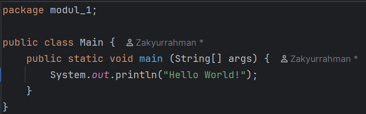

# Laporan Modul 1: Pengenalan Bahasa Java serta Lingkungan Pengembanganya
**Mata Kuliah:** Praktikum Pemrograman Berorientasi Objek   
**Nama:** MUHAMMAD ZAKYURRAHMAN 
**NIM:** 2024573010119  
**Kelas:** TI 2A

---

## Abstrak
Laporan ini membahas konsep dasar bahasa pemrograman Java dan ekosistem pendukungnya. Java merupakan bahasa pemrograman berorientasi objek (OOP) yang banyak digunakan dalam pengembangan perangkat lunak karena sifatnya yang portabel, aman, dan mudah dipelajari. 
Dalam laporan ini dijelaskan komponen-komponen penting seperti JDK (Java Development Kit), JRE (Java Runtime Environment), dan JVM (Java Virtual Machine), serta perannya dalam proses kompilasi dan eksekusi program Java. Selain itu, 
laporan ini juga membahas pentingnya paradigma OOP dalam membangun perangkat lunak yang terstruktur, modular, dan mudah dipelihara. Dengan memahami dasar Java dan ekosistemnya, mahasiswa diharapkan dapat menguasai konsep dasar pemrograman dan siap mengembangkan aplikasi sederhana menggunakan Java.

--- 

## 1. Pendahuluan

Teori Lengkap tentang Bahasa Java serta Lingkungan Pengembangannya.  

Java adalah bahasa pemrograman berorientasi objek yang bersifat portabel dan dapat dijalankan di berbagai platform. Dengan ekosistem yang terdiri dari JDK, JRE, dan JVM, Java menjadi salah satu bahasa yang paling banyak digunakan dalam pengembangan perangkat lunak. Laporan ini bertujuan memberikan pemahaman dasar mengenai Java dan ekosistemnya sebagai bekal sebelum mempelajari praktik pemrograman lebih lanjut.

---

## 2. Landasan Teori

1. Bahasa Pemrograman Java
    Java adalah bahasa pemrograman yang dikembangkan oleh Sun Microsystems pada tahun 1995 dan kini dikelola oleh Oracle. Salah satu keunggulan Java adalah kemampuannya dijalankan di berbagai platform menggunakan prinsip Write Once, Run Anywhere (WORA). Java juga mendukung paradigma Object-Oriented Programming (OOP) yang memudahkan pengembangan aplikasi yang terstruktur dan mudah dipelihara.

2. Ekosistem Java

Ekosistem Java terdiri dari beberapa komponen penting:

JDK (Java Development Kit)
Paket yang berisi compiler (javac), libraries, dan tools yang digunakan untuk menulis, mengompilasi, dan mendebug program Java.

JRE (Java Runtime Environment)
Lingkungan yang memungkinkan program Java dijalankan. JRE mencakup JVM dan libraries yang dibutuhkan saat eksekusi.

JVM (Java Virtual Machine)
Mesin virtual yang mengeksekusi bytecode Java. JVM membuat Java dapat berjalan di berbagai sistem operasi tanpa perlu mengubah kode sumber.

3. Pemrograman Berorientasi Objek (OOP)

OOP adalah paradigma pemrograman yang berfokus pada objek sebagai komponen utama. Java menerapkan empat pilar OOP:

Encapsulation: Menyembunyikan data dan hanya menyediakan akses melalui method.

Inheritance: Memungkinkan pewarisan sifat atau perilaku dari satu kelas ke kelas lain.

Polymorphism: Kemampuan method untuk memiliki banyak bentuk sesuai konteks.

Abstraction: Menyederhanakan kompleksitas dengan hanya menampilkan fitur penting kepada pengguna.

---

## 3. Proses instalasi Java

Berikut langkah-langkah instalasi Java (JDK) di Windows dengan cara yang telah di tetapkan pada modul:
1. Unduh Amazon Corretto JDK

-Buka browser, lalu kunjungi situs resmi Amazon Corretto.

-Pilih versi JDK LTS yang direkomendasikan, seperti Corretto 17 atau Corretto 21.

-Unduh installer untuk Windows (biasanya dengan ekstensi .msi).

2. Instalasi JDK di Windows

-Jalankan file .msi yang sudah diunduh. Jika muncul notifikasi keamanan (User Account Control), pilih Yes.

-Pada layar Welcome, klik Next.

-Setujui License Agreement dengan mencentang kotak persetujuan, lalu klik Next.

-Pada menu Custom Setup, biarkan pengaturan default, klik Next kemudian Install.

-Tunggu proses instalasi selesai, lalu klik Finish.

3. Konfigurasi Environment Variables

-Klik kanan pada This PC → pilih Properties → Advanced system settings.

-Klik Environment Variables.

-Pada bagian System variables, klik New dan buat variabel baru:

-Variable name: JAVA_HOME

-Variable value: lokasi folder instalasi JDK
,contoh: C:\Program Files\Amazon Corretto\jdk17.x.x_xx

-Cari variabel Path pada System variables, klik Edit → tambahkan %JAVA_HOME%\bin.

-Simpan semua perubahan.

4. Verifikasi Instalasi

-Buka Command Prompt dan ketik:
java -version

-Akan muncul informasi versi Java yang sudah terinstal.

-Ketik perintah berikut untuk memeriksa compiler:
javac -version

-Jika tampil versi yang sesuai, instalasi berhasil.

---

## 3. Laporan proses pembuatan program hello world dengan java
Berikut langkah-proses membuat program “Hello World” menggunakan Java di IntelliJ IDEA:

1. Membuat proyek baru di IntelliJ IDEA:

2. Buka IntelliJ IDEA Community Edition.

3. Pilih New Project. Pastikan Project SDK sudah di-set ke JDK yang telah diinstal. Jika belum, tambahkan SDK dengan menunjuk ke folder instalasi JDK.

4. Membuat class Java baru:Di dalam direktori src, klik kanan → New → Java Class. Beri nama Main.
5. menulis kode program

   
6. Menjalankan program:
   Klik run pada IntelliJ IDEA → program dijalankan. Hasil yang diharapkan muncul di konsol: Hello World

7. Di dalam direktori src, klik kanan → New → Java Class. Beri nama Main.
---

## 4. Referensi
Module 1 – Course Introduction & Lab Setup

Amazon Corretto – halaman resmi distribusi OpenJDK oleh Amazon — https://aws.amazon.com/corretto/
IntelliJ IDEA Community Edition – JetBrains — https://www.jetbrains.com/idea/
---