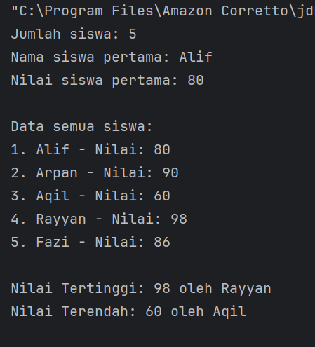
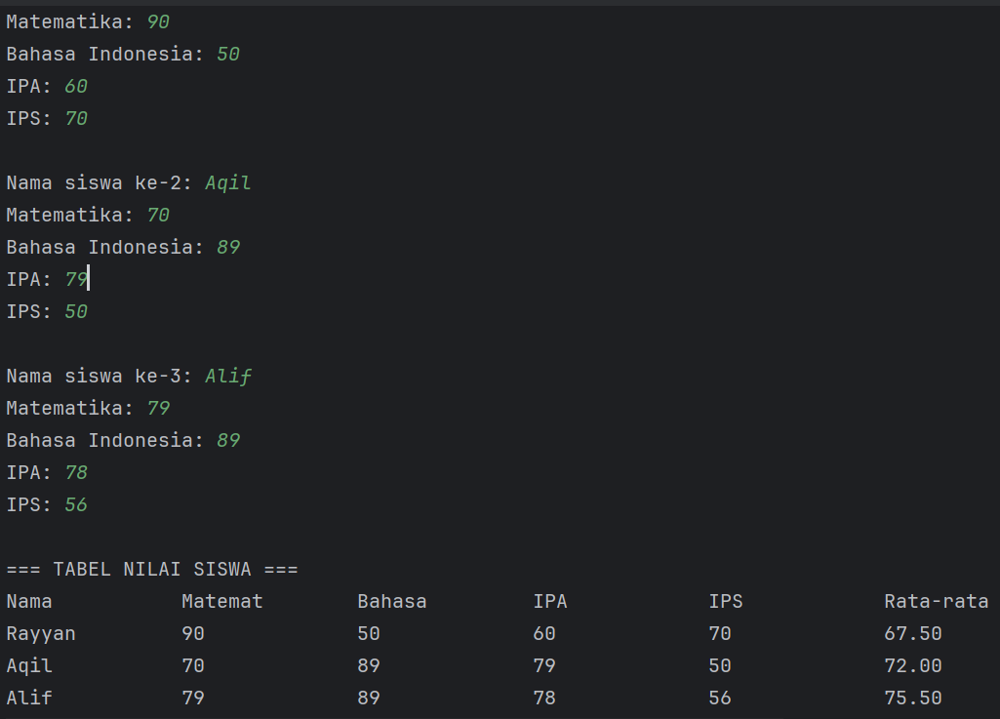
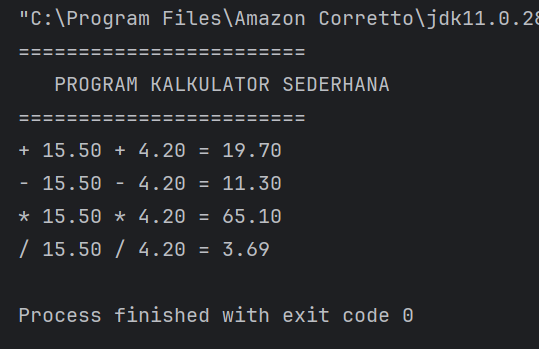
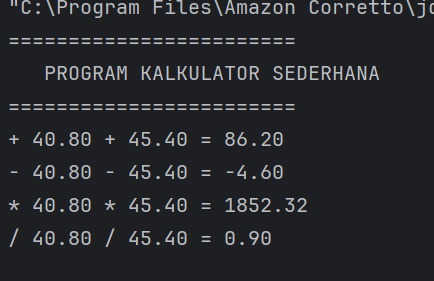
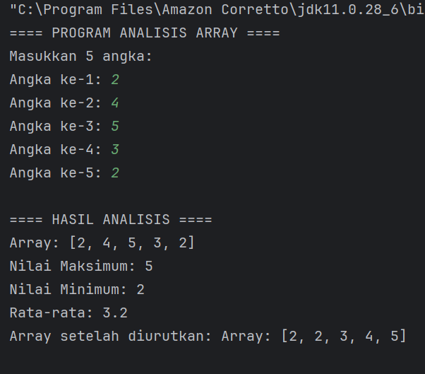
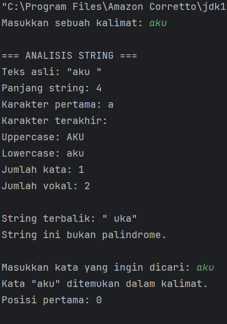
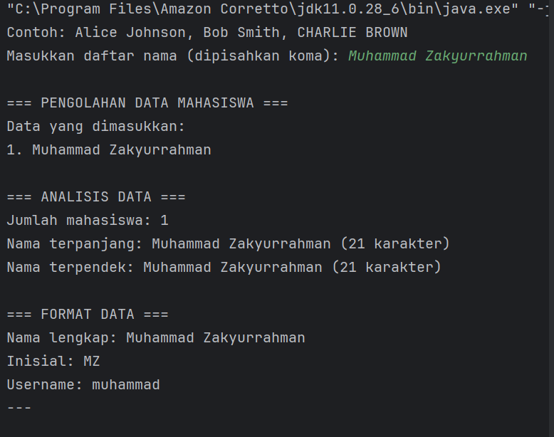

# LAPORAN PRAKTIKUM MODUL 3: Dasar Pemrograman Java Lanjutan
**Nama:** Muhammad Zakyurrahman

**NIM:** 2024573010119

**Kelas:** TI 2A

**Mata Kuliah:** Pemrograman Berorientasi Objek

---

## ABSTRAK
Modul 3 membahas konsep lanjutan dalam pemrograman Java yang mencakup penggunaan array, method
(fungsi), dan manipulasi string. Tujuan praktikum ini adalah agar mahasiswa memahami cara mengelola data 
terstruktur menggunakan array satu dan dua dimensi, membuat dan memanggil method dengan parameter
maupun return value, serta memanfaatkan class dan method bawaan Java untuk memanipulasi string. Melalui
praktikum ini, mahasiswa diharapkan mampu menerapkan prinsip modularitas, efisiensi, dan keterbacaan
kode dalam pemrograman Java.

---

# PRAKTIKUM
## 1. Array
### Dasar Teori
Array merupakan struktur data yang menyimpan sekumpulan elemen dengan tipe data yang sama. Setiap
elemen array diakses menggunakan indeks. Dalam Java, array bersifat statis, artinya ukuran array ditentukan
saat deklarasi. Operasi umum meliputi pengisian, pengambilan elemen, perulangan, dan perhitungan ratarata,
nilai maksimum, maupun minimum. Array menggunakan indeks untuk mengakses elemen-elemennya,
dimulai dari indeks 0.

---

### Karakteristik Array:
Semua elemen memiliki tipe data yang sama
Ukuran array bersifat tetap (fixed size)
Indeks dimulai dari 0
Elemen dapat diakses secara langsung menggunakan indeks

---

###  Syntax Array:
// Deklarasi array
tipeData[] namaArray = new tipeData[ukuran];

// Atau inisialisasi langsung
tipeData[] namaArray = {nilai1, nilai2, nilai3, ...};

---

## Praktikum 1: Array Satu Dimensi
Memahami cara mendeklarasikan, menginisialisasi, dan mengakses array satu dimensi.

### Langkah Praktikum Array Satu Dimensi
1. Buat file ArraySatuDimensi.java 
2. Ketik kode berikut:

   package modul_3;

public class ArraySatuDimensi {
public static void main(String[] args) {

// Langkah 1: Deklarasi dan inisialisasi array
int[] nilai = {85, 90, 78, 92, 88};
String[] nama = {"Alice", "Bob", "Charlie", "Diana", "Eva"};

    // Langkah 2: Menampilkan panjang array
    System.out.println("Jumlah siswa: " + nilai.length);

    // Langkah 3: Mengakses elemen array
    System.out.println("Nama siswa pertama: " + nama[0]);
    System.out.println("Nilai siswa pertama: " + nilai[0]);

    // Langkah 4: Menampilkan semua data menggunakan loop
    System.out.println("\nData semua siswa:");
    for (int i = 0; i < nama.length; i++) {
        System.out.println((i+1) + ". " + nama[i] + " - Nilai: " + nilai[i]);
    }
}
}

---

3. Compile dan jalankan program.
4. Modifikasi kode program diatas untuk menambahkan fitur pencarian nilai tertinggi dan terendah

### Screenshot hasil

---

### Analisa dan Pembahasan
1. Program ArraySatuDimensi ini menunjukkan cara penggunaan array satu dimensi dalam Java untuk
menyimpan dan mengolah data secara terstruktur. Dua array — nama (String) dan nilai (int) —
digunakan secara paralel untuk merepresentasikan data siswa dan nilai mereka.

2. Langkah awal, program mendeklarasikan dan menginisialisasi array dengan lima elemen. Kemudian,
menggunakan properti .length , program menampilkan jumlah siswa tanpa perlu menghitung manual.
Elemen array diakses melalui indeks (dimulai dari 0), misalnya nama[0] dan nilai[0] untuk siswa pertama.
3. Seluruh data siswa ditampilkan menggunakan perulangan for, sehingga setiap pasangan nama dan nilai
dicetak secara otomatis. Ini memperlihatkan efisiensi penggunaan array dibanding mencetak data satu per satu.
4. Selanjutnya, program melakukan pencarian nilai tertinggi dan terendah dengan membandingkan
setiap elemen menggunakan struktur if . Nilai awal diambil dari elemen pertama, lalu diperbarui jika
ditemukan nilai yang lebih tinggi atau rendah. Algoritma ini memiliki kompleksitas waktu O(n), cukup
efisien untuk data kecil hingga sedang.
5. Hasil akhir menampilkan siapa yang memiliki nilai tertinggi dan terendah. Secara keseluruhan, program
ini menegaskan konsep dasar array dalam Java — mulai dari inisialisasi, akses data, perulangan, hingga
pencarian sederhana — yang menjadi fondasi penting sebelum mempelajari struktur data yang lebih kompleks.
---

---

## Praktikum 2: Array Dua Dimensi
Memahami konsep dan penggunaan array dua dimensi (matriks).

### Langkah Praktikum Array Dua Dimensi
1. Buat file ArrayDuaDimensi.java .
2. Ketik kode berikut:
   package modul_3;

import java.util.Scanner;

public class Arrayduadimensi {
public static void main(String[] args) {
Scanner input = new Scanner(System.in);
// Langkah 1: Deklarasi array 2D untuk nilai siswa (3 siswa, 4 mata pelajaran)
int[][] nilaiSiswa = new int[3][4];
String[] namaSiswa = new String[3];
String[] mataPelajaran = {"Matematika", "Bahasa Indonesia", "IPA", "IPS"};

            // Langkah 2: Input nilai
            System.out.println("=== INPUT NILAI SISWA ===");
            for (int i = 0; i < 3; i++) {
                System.out.print("Nama siswa ke-" + (i + 1) + ": ");
                namaSiswa[i] = input.next();
                for (int j = 0; j < 4; j++) {
                    System.out.print(mataPelajaran[j] + ": ");
                    nilaiSiswa[i][j] = input.nextInt();
                }
                System.out.println();
            }

            // Langkah 3: Menampilkan data dalam bentuk tabel
            System.out.println("=== TABEL NILAI SISWA ===");
            System.out.printf("%-15s", "Nama");
            for (int i = 0; i < 4; i++) {
                // Mengambil 7 karakter pertama untuk header kolom
                System.out.printf("%-15s", mataPelajaran[i].substring(0, Math.min(7, mataPelajaran[i].length())));
            }
            System.out.printf("%-15s\n", "Rata-rata");

            for (int i = 0; i < 3; i++) {
                System.out.printf("%-15s", namaSiswa[i]);
                int total = 0;
                for (int j = 0; j < 4; j++) {
                    System.out.printf("%-15d", nilaiSiswa[i][j]);
                    total += nilaiSiswa[i][j];
                }
                double ratarata = total / 4.0;
                System.out.printf("%-15.2f\n", ratarata);
            }
        }
    }

---

3. Jalankan program dan test dengan input nilai yang berbeda
4. Analisa struktur array 2D yang telah dibuat
 
#### Screenshot Hasil

---

#### Analisa dan Pembahasan
1. Program ArrayDuaDimensi pada package modul_3 digunakan untuk mengelola dan menampilkan
data nilai siswa dalam beberapa mata pelajaran dengan memanfaatkan struktur array dua dimensi.
Tujuan utamanya adalah memahami bagaimana array dua dimensi bekerja untuk menyimpan data
dalam bentuk tabel, serta bagaimana menampilkan dan menghitung total serta rata-rata nilai setiap siswa.
2. Program dimulai dengan deklarasi beberapa array: namaSiswa untuk menyimpan nama lima siswa,
mataPelajaran untuk empat mata pelajaran, dan nilaiSiswa sebagai array dua dimensi bertipe int
berukuran 5×4 yang menampung nilai masing-masing siswa untuk setiap pelajaran. Struktur ini
menunjukkan bahwa indeks pertama ( i ) merepresentasikan siswa, sedangkan indeks kedua ( j )
mewakili mata pelajaran.
3. Pada tahap input, program menggunakan kelas Scanner untuk membaca nilai dari pengguna. Dengan
dua lapisan perulangan for, setiap siswa diminta mengisi nilai untuk seluruh mata pelajaran. Pola iterasi
bersarang ini ( for di dalam for ) adalah implementasi umum saat bekerja dengan array dua dimensi,
di mana satu loop mengakses baris dan loop lain mengakses kolom.
4. Setelah data dimasukkan, program menampilkan hasilnya dalam bentuk tabel terformat menggunakan
System.out.printf() . Format keluaran ini memperlihatkan nama siswa diikuti oleh nilai-nilai tiap
mata pelajaran, kemudian total nilai dan rata-rata. Penggunaan String.format dan lebar kolom tetap
( %-8s , %-10s ) membantu menjaga tampilan tabel agar rapi dan mudah dibaca.
5. Perhitungan total nilai dilakukan dengan menjumlahkan seluruh elemen pada baris yang sama
( nilaiSiswa[i][j] untuk setiap j ). Nilai rata-rata kemudian diperoleh dengan membagi total nilai
dengan jumlah mata pelajaran menggunakan casting ke tipe double agar hasil tidak dibulatkan secara
integer. Hal ini menegaskan pentingnya pemahaman tentang tipe data dalam operasi aritmetika di Java.
6. Secara keseluruhan, program ini memperlihatkan konsep fundamental dari array dua dimensi, yang
sering digunakan untuk representasi data berbentuk tabel seperti nilai siswa, matriks, atau data 
statistik. Melalui implementasi ini, mahasiswa dapat memahami cara menyimpan, mengakses, dan
mengolah data multidimensi secara sistematis menggunakan struktur perulangan bersarang dan
format keluaran yang terstruktur.

---

## Method/Function

### Dasar Teori
Method adalah blok kode yang dapat dipanggil untuk menjalankan tugas tertentu. Method memungkinkan
kita untuk:
- Menghindari pengulangan kode
- Membuat program lebih terstruktur
- Memudahkan debugging dan maintenance

Jenis Method:
- Static Method: Dapat dipanggil tanpa membuat object
- Non-static Method: Perlu membuat object terlebih dahulu
- Void Method: Tidak mengembalikan nilai
- Return Method: Mengembalikan nilai

Syntax Method:
java[access modifier] [static] returnType namaMethod(parameter) {
// body method
return value; // jika ada return type
}
---

## Praktikum Method Dasar
Memahami cara membuat dan memanggil method dengan berbagai jenis parameter dan return type.
Langkah Praktikum Method Dasar
1. Buat file MethodDasar.java .
2. Ketik kode berikut:
   package modul_3;

public class MethodDasar {// Langkah 1: Method void tanpa parameter
public static void tampilkanHeader() {
System.out.println("========================");
System.out.println("   PROGRAM KALKULATOR SEDERHANA   ");
System.out.println("========================");
}

    // Langkah 2: Method void dengan parameter
    public static void tampilkanHasil(String operasi, double a, double b, double hasil) {
        System.out.printf("%s %.2f %s %.2f = %.2f%n", operasi, a, operasi, b, hasil);
    }

    // Langkah 3: Method dengan return value
    public static double tambah(double a, double b) {
        return a + b;
    }

    public static double kurang(double a, double b) {
        return a - b;
    }

    public static double kali(double a, double b) {
        return a * b;
    }

    public static double bagi(double a, double b) {
        if (b != 0) {
            return a / b;
        } else {
            System.out.println("Error: Pembagian dengan nol!");
            return 0;
        }
    }

    // Langkah 4: Method dengan validasi input
    public static boolean validasiAngka(double angka) {
        return !Double.isNaN(angka) && !Double.isInfinite(angka);
    }

    // Langkah 5: Menggunakan semua method
    public static void main(String[] args) {
        tampilkanHeader();

        double x = 15.5;
        double y = 4.2;

        if (validasiAngka(x) && validasiAngka(y)) {
            double hasilTambah = tambah(x, y);
            double hasilKurang = kurang(x, y);
            double hasilKali = kali(x, y);
            double hasilBagi = bagi(x, y);

            tampilkanHasil("+", x, y, hasilTambah);
            tampilkanHasil("-", x, y, hasilKurang);
            tampilkanHasil("*", x, y, hasilKali);
            tampilkanHasil("/", x, y, hasilBagi);
        }
    }
}

---

#### Screenshot Hasil

   Coba ubah nilai x dan y dengan nilai yang berbeda

---

### Analisa dan Pembahasan
   Program MethodDasar ini bertujuan untuk memperkenalkan konsep method (fungsi) dalam bahasa
   pemrograman Java. Program ini menggabungkan berbagai jenis method: void tanpa parameter, void dengan
   parameter, method dengan nilai balik (return value), dan method dengan validasi input. Melalui contoh sederhana
   berupa kalkulator empat operasi dasar, mahasiswa dapat memahami bagaimana modularitas meningkatkan
   keteraturan dan keterbacaan kode. 
   
#### Alur Program dan Logika Utama
1. Deklarasi Method tampilkanHeader()
   - Merupakan method void tanpa parameter.
   - Fungsinya hanya untuk menampilkan header atau judul program agar tampilan lebih terstruktur.
   - Menunjukkan penerapan prinsip modularisasi tampilan output.
2. Method tampilkanHasil(String operasi, double a, double b, double hasil)
   - Termasuk void method dengan parameter.
   - Menerima empat parameter untuk mencetak hasil perhitungan dengan format rapi
   menggunakan printf .
   - Penggunaan format %.2f memastikan angka desimal ditampilkan dengan dua digit presisi.
3. Method tambah , kurang , kali , dan bagi
   - Keempatnya merupakan method dengan nilai balik (return value) bertipe double .
   - Setiap method melakukan satu operasi aritmetika sesuai namanya.
   - Method bagi() memiliki pengkondisian untuk mencegah pembagian dengan nol — hal ini
   merupakan bentuk error handling sederhana untuk menjaga keandalan program.
4. Method validasiAngka(double angka)
   - Bertugas memeriksa apakah nilai input valid, yaitu bukan NaN (Not a Number) dan bukan nilai
   tak hingga ( Infinity ).
   - Menggunakan fungsi bawaan Java Double.isNaN() dan Double.isFinite() untuk memastikan
   keakuratan perhitungan.
5. Method main()
   - Menjadi titik masuk eksekusi program.
   - Memanggil semua method di atas secara terstruktur:
   1. Menampilkan header.
   2. Mendefinisikan dua angka ( x dan y ).
   3. Melakukan validasi input menggunakan validasiAngka() .
   4. Jika valid, menghitung hasil operasi dengan tambah , kurang , kali , dan bagi .
   5. Menampilkan seluruh hasil perhitungan menggunakan tampilkanHasil() .

---

#### Analisis Struktural dan Konseptual
   - **Prinsip Modularitas:**
   Setiap tugas logika dipisahkan ke dalam method berbeda, sehingga kode menjadi lebih mudah dibaca,
   diuji, dan dikelola.
   Ini mencerminkan konsep utama dalam pemrograman berorientasi objek (OOP): pemisahan tanggung
   jawab dan pengorganisasian kode.
   - **Reusabilitas dan Fleksibilitas:**
   Dengan membuat method seperti tambah() atau tampilkanHasil() , kode dapat digunakan kembali
   tanpa penulisan ulang. Misalnya, operasi tambahan baru dapat ditambahkan dengan mudah tanpa
   mengubah struktur utama program.
   - **Error Handling:**
   Validasi pada method bagi() dan validasiAngka() mencegah kesalahan umum (seperti pembagian
   nol atau input tidak valid), menunjukkan kesadaran akan stabilitas program.
   - **Output Formatting:**
   Penggunaan System.out.printf memberikan tampilan hasil yang konsisten dan profesional,
   dibandingkan println biasa.

---

## Praktikum Method Dengan Array
Memahami cara menggunakan method untuk memproses array.

### Langkah Praktikum Method dengan Array
1. Buat file ArrayMethod.java .
2. Ketik kode berikut:
   package modul_3;

import java.util.Scanner;

public class ArrayMethod {

    // Method untuk input array
    public static int[] inputArray(int ukuran) {
        Scanner input = new Scanner(System.in);
        int[] array = new int[ukuran];
        System.out.println("Masukkan " + ukuran + " angka:");
        for (int i = 0; i < ukuran; i++) {
            System.out.print("Angka ke-" + (i + 1) + ": ");
            array[i] = input.nextInt();
        }
        return array;
    }

    // Method untuk menampilkan array
    public static void tampilkanArray(int[] array) {
        System.out.print("Array: [");
        for (int i = 0; i < array.length; i++) {
            System.out.print(array[i]);
            if (i < array.length - 1)
                System.out.print(", ");
        }
        System.out.println("]");
    }

    // Method untuk mencari nilai maksimum (Dikonstruksi berdasarkan potongan dan fungsi)
    public static int cariMaksimum(int[] array) {
        int maks = array[0];
        for (int i = 1; i < array.length; i++) {
            if (array[i] > maks) {
                maks = array[i];
            }
        }
        return maks;
    }

    // Method untuk mencari nilai minimum (Dikonstruksi berdasarkan deskripsi praktikum)
    public static int cariMinimum(int[] array) {
        int min = array[0];
        for (int i = 1; i < array.length; i++) {
            if (array[i] < min) {
                min = array[i];
            }
        }
        return min;
    }

    // Method untuk menghitung rata-rata (Dikonstruksi berdasarkan potongan)
    public static double hitungRataRata(int[] array) {
        int total = 0;
        for (int nilai : array) {
            total += nilai;
        }
        return (double) total / array.length;
    }

    // Method untuk mengurutkan array (Bubble Sort)
    public static int[] urutkanArray(int[] array) {
        int[] arrayBaru = array.clone(); // Membuat copy array
        for (int i = 0; i < arrayBaru.length - 1; i++) {
            for (int j = 0; j < arrayBaru.length - 1 - i; j++) {
                if (arrayBaru[j] > arrayBaru[j + 1]) {
                    // Tukar posisi
                    int temp = arrayBaru[j];
                    arrayBaru[j] = arrayBaru[j + 1];
                    arrayBaru[j + 1] = temp;
                }
            }
        }
        return arrayBaru;
    }

    public static void main(String[] args) {
        System.out.println("==== PROGRAM ANALISIS ARRAY ====");
        int[] data = inputArray(5);

        System.out.println("\n==== HASIL ANALISIS ====");
        tampilkanArray(data);
        System.out.println("Nilai Maksimum: " + cariMaksimum(data));
        System.out.println("Nilai Minimum: " + cariMinimum(data));
        System.out.println("Rata-rata: " + hitungRataRata(data));

        int[] dataTerurut = urutkanArray(data);
        System.out.print("Array setelah diurutkan: ");
        tampilkanArray(dataTerurut);
    }
}

---

#### Screenshot Hasil

---

#### Analisa dan Pembahasan
   Program ArrayMethod.java adalah implementasi latihan pemrograman Java yang berfokus pada
   penggunaan array dan method secara modular. Tujuan utama program ini adalah mengolah sekumpulan
   data numerik — mulai dari input, penampilan, pencarian nilai maksimum dan minimum, penghitungan ratarata,
   hingga pengurutan nilai. Program ini menunjukkan penerapan prinsip modular programming dan code
   reusability dalam bentuk method yang terpisah, sehingga lebih mudah dibaca, diuji, dan dikembangkan.
1. **Struktur dan Fungsi Program**
   Program berada dalam package modul_3 dan terdiri dari beberapa method utama:
   - inputArray(int ukuran)
   Method ini bertugas menerima input dari pengguna dengan menggunakan objek Scanner .
   Ukuran array ditentukan oleh parameter yang diberikan. Setiap elemen diisi melalui perulangan for ,
   kemudian dikembalikan sebagai array integer.
   - tampilkanArray(int[] array)
   Menampilkan seluruh elemen array dalam format [a, b, c, ...] .
   Penggunaan kondisi if memastikan tidak ada koma berlebih di akhir tampilan.
   - cariMaksimum(int[] array) dan cariMinimum(int[] array)
   Masing-masing digunakan untuk mencari nilai terbesar dan terkecil dari elemen array.
   Implementasi dilakukan dengan asumsi awal bahwa elemen pertama ( array[0] ) adalah nilai acuan,
   lalu dibandingkan secara iteratif.
   - hitungRataRata(int[] array)
   Menghitung rata-rata seluruh elemen array dengan cara menjumlahkan semua nilai, kemudian
   membaginya dengan panjang array ( array.length ).
   Hasil dikembalikan dalam bentuk double agar mendukung angka desimal.
   - urutkanArray(int[] array)
   Mengurutkan array menggunakan algoritma Bubble Sort.
   Sebelum pengurutan, array asli dikloning ke arrayBaru agar data awal tidak berubah (immutability
   principle).
   Nilai yang lebih besar ditukar secara bertahap hingga seluruh elemen terurut naik.
   - main()
   Method utama program yang memanggil semua fungsi di atas.
   Program dimulai dengan menampilkan header, lalu menerima input 5 angka dari pengguna.
   Setelah itu, hasil analisis seperti nilai maksimum, minimum, rata-rata, dan array terurut ditampilkan.

2. **Alur Logika Program**

- Program menampilkan judul === PROGRAM ANALISIS ARRAY === .
- Pengguna diminta memasukkan 5 angka integer.
- Program menampilkan seluruh angka yang dimasukkan.
- Program menghitung dan menampilkan:
   - Nilai maksimum
   - Nilai minimum
   - Nilai rata-rata (dengan dua angka di belakang koma)
- Program mengurutkan array menggunakan algoritma Bubble Sort.
- Hasil pengurutan ditampilkan kembali untuk dibandingkan dengan data awal.

3. **Analisis Teknis**
   - **Modularisasi Kode**
   Setiap operasi dikelompokkan dalam method terpisah, memudahkan debugging dan pemeliharaan.
   Ini juga mempermudah pemanggilan ulang fungsi tanpa mengulang kode (DRY principle).
   - **Efisiensi Algoritmik**
   Bubble Sort bukan algoritma paling efisien ( O(n²) ), namun dipilih karena mudah dipahami dan cocok
   untuk dataset kecil.
   Untuk data besar, sebaiknya diganti dengan algoritma yang lebih efisien seperti QuickSort atau
   MergeSort.
   - **Validitas dan Keamanan Input**
   Karena menggunakan Scanner , program masih bergantung pada input numerik dari pengguna.
   Tidak ada pengecekan kesalahan ( InputMismatchException ), jadi input non-angka bisa menyebabkan
   error — ini bisa dikembangkan lebih lanjut.
   - **Pemakaian Memori**
   Penggunaan clone() pada array menghindari mutasi data asli, yang merupakan praktik baik dalam
   pengolahan data agar hasil analisis tetap akurat.

4. **Kesimpulan**
   Program ArrayMethod.java secara efektif menunjukkan konsep dasar pengolahan array menggunakan
   pendekatan modular.
   Struktur fungsi yang terpisah menjadikan kode mudah diperluas dan dipelihara.
   Semua operasi — mulai dari input, analisis data, hingga pengurutan — berjalan sesuai urutan logis dan
   menghasilkan keluaran yang mudah dipahami.

---

## C. String dan Manipulasi String
### Dasar Teori
String adalah tipe data yang menyimpan rangkaian karakter. Di Java, String adalah object yang memiliki banyak
method built-in untuk manipulasi teks.

**Karakteristik String di Java:**
- String bersifat immutable (tidak dapat diubah)
- Setiap operasi String menghasilkan String baru
- Java menyediakan banyak method untuk manipulasi String

**Method String yang Penting:**
- length(): mendapatkan panjang string
- charAt(): mendapatkan karakter pada indeks tertentu
- substring(): mengambil bagian string
- toLowerCase() / toUpperCase(): mengubah case
- contains(): mengecek apakah string mengandung substring
- replace(): mengganti karakter/substring

---

### Praktikum Manipulasi String Dasar

Memahami berbagai method manipulasi string dan penggunaannya.

#### Langkah Praktikum Manipulasi String Dasar
1. Buat file StringDasar.java .
2. ketik kode berikut:
   package modul_3;

import java.util.Scanner;

public class StringDasar {

    public static void analisisString(String teks) {
    System.out.println("\n=== ANALISIS STRING ===");
    System.out.println("Teks asli: \"" + teks + "\"");
    System.out.println("Panjang string: " + teks.length());
    System.out.println("Karakter pertama: " + teks.charAt(0));
    System.out.println("Karakter terakhir: " + teks.charAt(teks.length() - 1));
    System.out.println("Uppercase: " + teks.toUpperCase());
    System.out.println("Lowercase: " + teks.toLowerCase());

    // Menghitung jumlah kata
    String[] kata = teks.trim().split("\\s+");
    System.out.println("Jumlah kata: " + kata.length);

    // Menghitung jumlah vokal
    int jumlahVokal = hitungVokal(teks);
    System.out.println("Jumlah vokal: " + jumlahVokal);
    // Method hitungKonsonan() seharusnya dipanggil di sini juga
}

    public static int hitungVokal(String teks) {
        String vokal = "aeiouAEIOU";
        int count = 0;
        for (int i = 0; i < teks.length(); i++) {
            // Logika disimpulkan dari fungsionalitas
            if (vokal.contains(String.valueOf(teks.charAt(i)))) {
                count++;
            }
        }
        return count;
    }

    // Method untuk membalik string (Dikonstruksi)
    public static String reverseString(String teks) {
        return new StringBuilder(teks).reverse().toString();
    }

    // Method untuk cek palindrome (Dikonstruksi)
    public static boolean isPalindrome(String teks) {
        // Membersihkan string dari spasi/simbol dan mengubah ke lowercase untuk perbandingan
        String cleanTeks = teks.replaceAll("[^a-zA-Z0-9]", "").toLowerCase();
        String reversed = new StringBuilder(cleanTeks).reverse().toString();
        return cleanTeks.equals(reversed);
    }

    public static void main(String[] args) {
        Scanner input = new Scanner(System.in);
        System.out.print("Masukkan sebuah kalimat: ");
        String kalimat = input.nextLine();

        // Analisis dasar
        analisisString(kalimat);

        // String terbalik
        System.out.println("\nString terbalik: \"" + reverseString(kalimat) + "\"");

        // Cek palindrome
        if (isPalindrome(kalimat)) {
            System.out.println("String ini adalah palindrome!");
        } else {
            System.out.println("String ini bukan palindrome.");
        }

        // Pencarian substring
        System.out.print("\nMasukkan kata yang ingin dicari: ");
        String cari = input.nextLine();

        if (kalimat.toLowerCase().contains(cari.toLowerCase())) {
            System.out.println("Kata \"" + cari + "\" ditemukan dalam kalimat.");
            int posisi = kalimat.toLowerCase().indexOf(cari.toLowerCase());
            System.out.println("Posisi pertama: " + posisi);
        } else {
            System.out.println("Kata \"" + cari + "\" tidak ditemukan dalam kalimat.");
        }
    }
}

---

#### Screenshot Hasil

---
#### Analisa dan Pembahasan

**Analisa Struktur dan Fungsi Program**

1. analisisString(String teks)
   Method ini berfungsi untuk melakukan analisis dasar terhadap teks yang diinput pengguna, meliputi:
   
- Panjang string ( teks.length() ),
- Karakter pertama dan terakhir ( charAt(0) dan charAt(length - 1) ),
- Perubahan huruf ke uppercase dan lowercase,
- Jumlah kata (menggunakan split("\\s+") ),
- Jumlah huruf vokal (menggunakan method hitungVokal() ).

2. hitungVokal(String teks)
   Method ini menghitung jumlah huruf vokal ( a, i, u, e, o ) dalam string.
   Proses dilakukan dengan memeriksa setiap karakter apakah termasuk dalam kumpulan huruf vokal
   ( vokal.contains(...) ).
   Semua karakter diperiksa satu per satu menggunakan perulangan for .
3. reverseString(String teks)
   Method ini membalik urutan karakter dari string input menggunakan StringBuilder dan perulangan dari
   belakang ke depan.
   Hasilnya berupa string baru dengan urutan karakter terbalik.
4. isPalindrome(String teks)
   Method ini memeriksa apakah string yang dimasukkan merupakan palindrom, yaitu teks yang sama jika
   dibaca dari depan maupun belakang.
   Langkah-langkahnya:
   - Menghapus karakter non-alfanumerik ( replaceAll("[^a-zA-Z0-9]", "") ),
   - Mengubah ke huruf kecil ( toLowerCase() ),
   - Membandingkan dengan hasil string yang dibalik.
5. main(String[] args)
   Bagian ini mengatur alur utama program:
- Pengguna diminta memasukkan kalimat.
- Program melakukan analisis teks dasar melalui analisisString() .
- Menampilkan hasil string terbalik dengan reverseString() .
- Mengecek apakah kalimat termasuk palindrom.
- Meminta pengguna memasukkan kata untuk dicari dalam kalimat.
- Melakukan pencarian substring menggunakan contains() dan indexOf() .
   
**Pembahasan Logika Program**

1. **Input dan Analisis Dasar**
   Program pertama-tama menerima input berupa kalimat, kemudian menganalisis berbagai atributnya
   (panjang, huruf pertama/terakhir, huruf besar/kecil, jumlah kata, jumlah vokal).
2. **Manipulasi String Terbalik**
   Setelah analisis, program membalik teks untuk menunjukkan kemampuan manipulasi karakter secara
   manual.
3. **Deteksi Palindrom**
   Program melakukan pembersihan teks dari karakter non-huruf dan spasi, lalu membandingkan versi
   normal dan terbalik untuk menentukan apakah kalimat merupakan palindrom.
4. **Pencarian Substring**
   Program kemudian meminta pengguna mengetik kata tertentu, memeriksa keberadaannya dalam
   kalimat menggunakan metode case-insensitive search, dan menampilkan posisi kemunculan pertama.
   
**Analisa Kelebihan Program**

   - Menggunakan berbagai konsep dasar manipulasi string di Java secara komprehensif.
   - Menunjukkan penggunaan method built-in ( length , charAt , toUpperCase , split , contains ,
   indexOf ).
   - Adanya fitur palindrom dan reverse string memperlihatkan logika pemrosesan manual yang baik.
   - Dapat menganalisis teks dari berbagai jenis input pengguna.

**Keterbatasan Program**

   - Tidak ada validasi untuk input kosong — jika pengguna tidak mengetik apa pun, program dapat
   menimbulkan StringIndexOutOfBoundsException .
   - Program hanya menghitung vokal huruf Latin (tidak termasuk huruf dengan aksen seperti é atau ô ).
   - Pencarian substring hanya menampilkan posisi pertama, tidak semua posisi kemunculan kata.
   - Palindrom hanya mempertimbangkan huruf dan angka, bukan spasi atau tanda baca secara semantik.
   
**Kesimpulan analisis**

   Program StringDasar berhasil mengimplementasikan berbagai operasi manipulasi string dalam bahasa Java
   dengan struktur modular dan jelas.
   Dengan memanfaatkan kombinasi antara fungsi bawaan Java dan logika perulangan manual, program ini
   dapat:
   - Melakukan analisis teks sederhana,
   - Mengetahui karakteristik string,
   - Melakukan transformasi serta pencarian teks.

---

### Praktikum Pengolahan Data Text
   Memahami penggunaan string untuk pengolahan data dalam format teks. 
   
### Langkah Praktikum Pengolahan Data Text
1. Buat file TextProcessing.java .
2. ketik kode berikut:
   package modul_3;

import java.util.Scanner;

public class TextProcessing {

    public static void prosesDataMahasiswa(String data) {
    System.out.println("\n=== PENGOLAHAN DATA MAHASISWA ===");
    // Memisahkan data berdasarkan koma
    String[] dataMahasiswa = data.split(",");

    System.out.println("Data yang dimasukkan:");
    for (int i = 0; i < dataMahasiswa.length; i++) {
        dataMahasiswa[i] = dataMahasiswa[i].trim(); // Menghilangkan spasi
        System.out.println((i + 1) + ". " + dataMahasiswa[i]);
    }

    // Analisis data
    System.out.println("\n=== ANALISIS DATA ===");
    System.out.println("Jumlah mahasiswa: " + dataMahasiswa.length);

    // Mencari nama terpanjang dan terpendek
    String namaTerpanjang = dataMahasiswa[0];
    String namaTerpendek = dataMahasiswa[0];

    for (String nama : dataMahasiswa) {
        if (nama.length() > namaTerpanjang.length()) {
            namaTerpanjang = nama;
        }
        if (nama.length() < namaTerpendek.length()) {
            namaTerpendek = nama;
        }
    }
    // Output Analisis (Dikonstruksi berdasarkan hasil screenshot)
    System.out.println("Nama terpanjang: " + namaTerpanjang + " (" + namaTerpanjang.length() + " karakter)");
    System.out.println("Nama terpendek: " + namaTerpendek + " (" + namaTerpendek.length() + " karakter)");

    System.out.println("\n=== FORMAT DATA ===");
    for (String nama : dataMahasiswa) {
        String namaFormatted = formatTitleCase(nama);
        String inisial = buatInisial(namaFormatted);

        System.out.println("Nama lengkap: " + namaFormatted);
        System.out.println("Inisial: " + inisial);
        System.out.println("Username: " + buatUsername(namaFormatted));
        System.out.println("---");
    }
}

    public static String formatTitleCase(String teks) {
        String[] kata = teks.toLowerCase().split(" ");
        StringBuilder result = new StringBuilder();

        for (String k : kata) {
            if (k.length() > 0) {
                result.append(Character.toUpperCase(k.charAt(0)))
                        .append(k.substring(1))
                        .append(" ");
            }
        }
        return result.toString().trim();
    }

    public static String buatInisial(String nama) {
        String[] kata = nama.split(" ");
        StringBuilder inisial = new StringBuilder();

        for (String k : kata) {
            if (k.length() > 0) {
                inisial.append(Character.toUpperCase(k.charAt(0)));
            }
        }
        return inisial.toString();
    }

    // Method untuk membuat username (Dikonstruksi berdasarkan hasil screenshot)
    public static String buatUsername(String nama) {
        // Mengambil kata pertama dan mengubahnya menjadi huruf kecil
        String[] kata = nama.split(" ");
        return kata[0].toLowerCase();
    }

    public static void main(String[] args) {
        Scanner input = new Scanner(System.in);
        System.out.println("Contoh: Alice Johnson, Bob Smith, CHARLIE BROWN");
        System.out.print("Masukkan daftar nama (dipisahkan koma): ");
        String dataInput = input.nextLine();
        prosesDataMahasiswa(dataInput);
    }
}

---
#### Screenshot Hasil

---

#### Analisa dan Pembahasan

1. **Analisa Program**
   Program TextProcessing.java berfungsi untuk mengolah data teks berupa daftar nama mahasiswa.
   Fitur utama yang dimiliki antara lain:
   
- **Pemecahan input:** Input string yang berisi nama mahasiswa dipisahkan koma, lalu dipecah menjadi
   array menggunakan split(",") .
- **Menampilkan data:** Setiap nama ditampilkan setelah di-trim (menghapus spasi di awal/akhir).
- **Analisis panjang nama:**
   - Menentukan nama terpanjang dan terpendek berdasarkan jumlah karakter.
   - Menampilkan jumlah total mahasiswa.
- **Pengurutan alfabet:** Array nama diurutkan menggunakan metode nested loop dan
   compareToIgnoreCase() untuk membandingkan string tanpa memperhatikan huruf kapital.
- **Format nama:**
   - Mengubah setiap nama menjadi Title Case (huruf pertama tiap kata kapital).
   - Membuat inisial dari nama.
   - Membuat username sederhana dari nama (huruf kecil dan underscore).
   
- **Kelebihan**

1. **Modularitas:** Fungsi dipisahkan menjadi beberapa method ( prosesDataMahasiswa , formatNama ,
   formatTitleCase , buatInisial , buatUsername ), mempermudah pembacaan dan pemeliharaan kode.
2. **Informasi Lengkap:** Menampilkan banyak informasi berguna dari data input seperti jumlah mahasiswa,
   nama terpanjang, terpendek, dan urutan alfabet.
3. **Format Nama Konsisten:** Penggunaan Title Case membuat tampilan nama lebih rapi dan seragam.

- **Kekurangan / Potensi Perbaikan**
1. **Validasi Input:** Program belum memeriksa apakah input kosong atau tidak sesuai format (misalnya
   tidak menggunakan koma), sehingga bisa menimbulkan error.
2. **Efisiensi Pengurutan:** Pengurutan menggunakan nested loop (O(n²)) tidak efisien untuk data besar.
   Bisa diganti dengan Arrays.sort() untuk performa lebih baik.
3. **Bug Username:** Regex [a-zA-Z0-9] sebelumnya menghapus semua huruf dan angka, menyebabkan
   username kosong. Perlu diperbaiki agar hanya karakter non-alfanumerik dihapus.
4. **Pemisahan Logika:** Input, pemrosesan, dan output masih bercampur dalam main() . Bisa dipisahkan
   agar kode lebih bersih dan mudah dites.
5. **Fitur Tambahan:** Bisa ditambahkan fitur pencarian nama, filter huruf awal, penghitungan jumlah
   karakter konsonan, atau menyimpan data ke file.

---

2. **Pembahasan**
   - **Pemecahan Input dan Analisis**
   Pemecahan input dengan split(",") memudahkan program untuk mengelola setiap nama. Analisis
   nama terpanjang/terpendek dilakukan dengan perulangan sederhana, membandingkan panjang string
   tiap nama.
   - **Pengurutan Alfabet**
   Nested loop digunakan untuk membandingkan setiap pasangan nama. Ini bekerja baik untuk jumlah
   data kecil, tapi kurang optimal untuk dataset besar. Penggunaan Arrays.sort() bisa meningkatkan
   efisiensi.
   - **Format Nama, Inisial, dan Username**
   Mengubah nama ke Title Case menggunakan kombinasi toLowerCase() , split(" ") , dan
   Character.toUpperCase() memastikan huruf pertama tiap kata kapital.
   Inisial dibuat dengan mengambil huruf pertama tiap kata.
   Username dibentuk dengan huruf kecil dan mengganti spasi menjadi underscore, dengan penghapusan
   karakter non-alfanumerik agar username valid.
   - **Keseluruhan Alur Program**
   Program dimulai dari input string, kemudian dilakukan:
- Analisis dasar (jumlah mahasiswa, nama terpanjang/terpendek).
- Pengurutan nama secara alfabet.
- Format nama, pembuatan inisial, dan username.
   Alur ini membuat data menjadi lebih terstruktur dan siap digunakan untuk keperluan
   administrasi atau praktikum pengolahan teks.

---

#### Kesimpulan
   Program TextProcessing.java berhasil mengimplementasikan konsep dasar pengolahan string di Java.
   Dengan perbaikan minor seperti validasi input, efisiensi pengurutan, dan perbaikan pembuatan username,
   program ini bisa menjadi alat praktikum pengolahan teks yang efektif. Fitur tambahan seperti
   penghitungan konsonan atau pencarian nama akan meningkatkan fungsionalitasnya.

---   

## Referensi
   Oracle. Java SE Documentation. https://docs.oracle.com/javase
   Modul Praktikum PBO, Modul 2: Dasar Pemrograman Java
1. Oracle. The Java™ Tutorials – Learning the Java Language. Oracle.
   https://docs.oracle.com/javase/tutorial/java/index.html
   (Referensi dasar sintaks Java, penggunaan array, string, dan kontrol program)
2. Eck, David J. Introduction to Programming Using Java, 8th Edition.
   https://math.hws.edu/javanotes/
   (Referensi untuk manipulasi array, string, input/output, dan struktur data sederhana)
3. TutorialsPoint. Java String Handling. TutorialsPoint.
   https://www.tutorialspoint.com/java/java_string_handling.htm
   (Referensi untuk operasi string, seperti menghitung karakter, substring, palindrome, dan pascal case)
4. Sedgewick, Robert & Wayne, Kevin. Algorithms, 4th Edition. Addison-Wesley, 2011.
   (Referensi algoritma pengurutan, pencarian, dan analisis data array)
5. Horstmann, Cay S. Core Java Volume I – Fundamentals, 11th Edition. Prentice Hall, 2019.
   (Referensi tambahan terkait pemrograman berorientasi objek, method, dan manipulasi data)