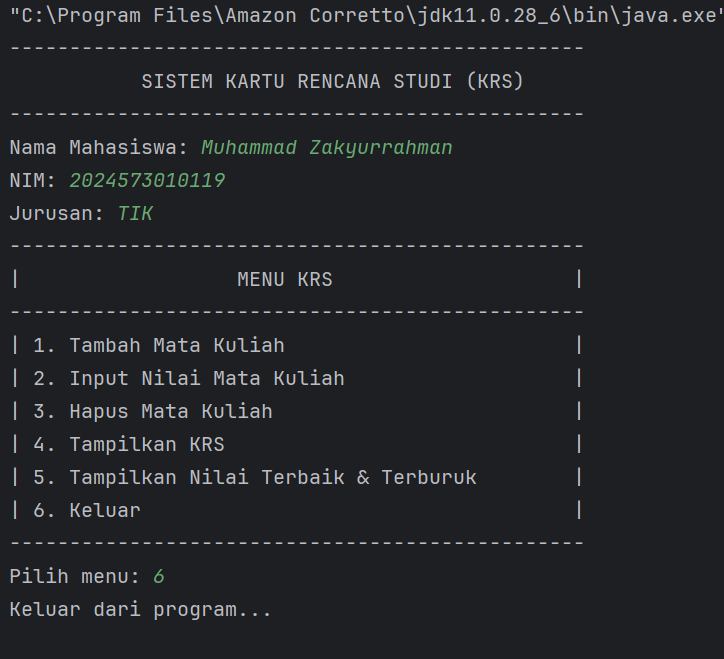
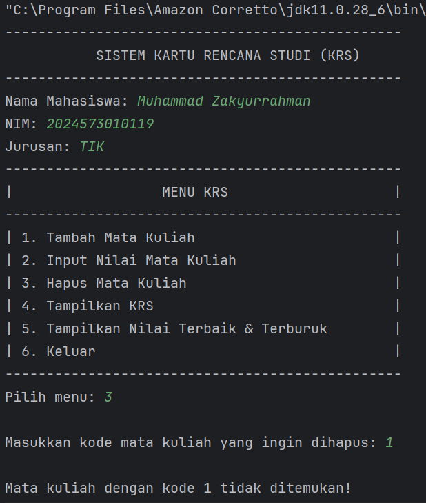
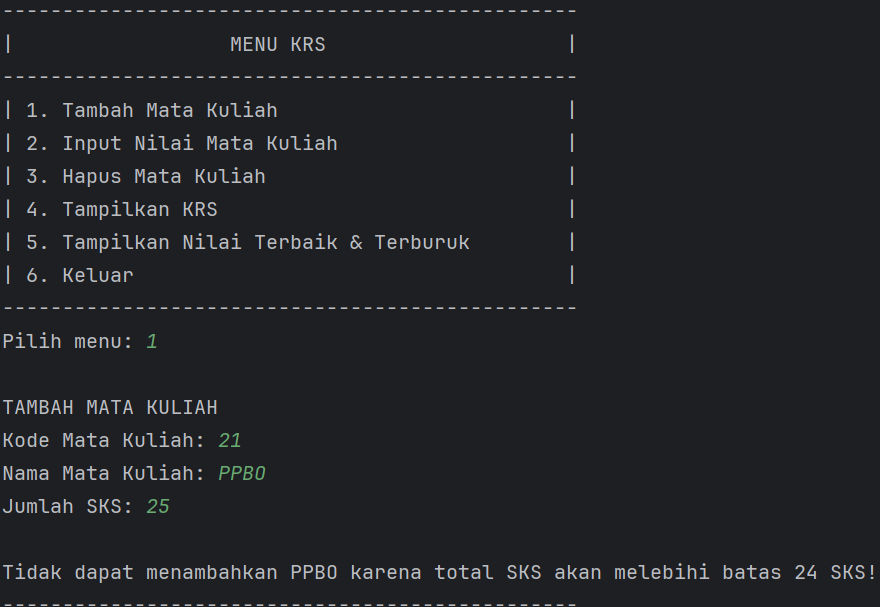
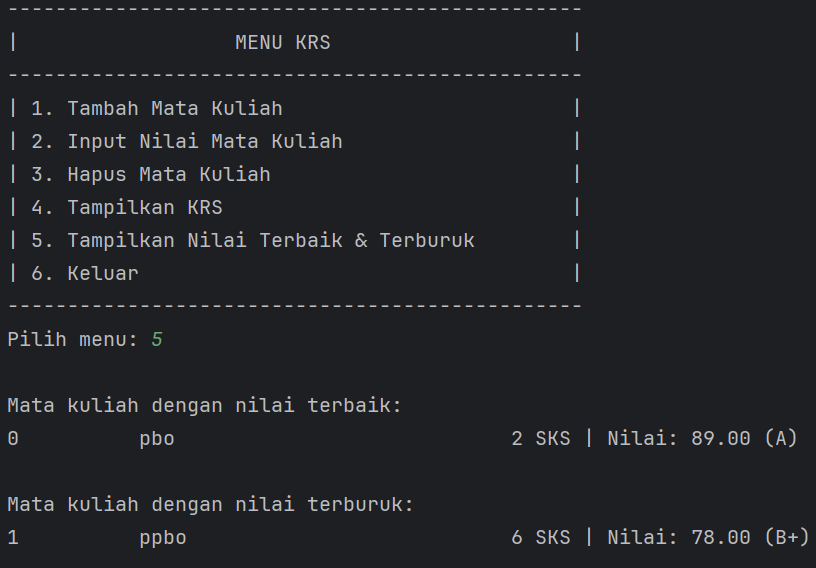

# LAPORAN PRAKTIKUM 4: PENGENALAN OBJECT ORIENTED PROGRAMMING 
***NAMA:*** Muhammad Zakyurrahman

***KELAS:*** TI 2A

***NIM:*** 2024573010119

***MATA KULIAH:*** Praktikum Pemrograman Berorientasi Objek

---

## 1. Abstrak

Modul 4 membahas konsep dasar **Pemrograman Berorientasi Objek (OOP)** dalam bahasa Java yang mencakup pembuatan class, object, constructor, dan interaksi antar class. Tujuan utama praktikum ini adalah agar mahasiswa memahami penerapan prinsip OOP seperti enkapsulasi, komposisi, serta relasi antar objek melalui studi kasus sistem **Rencana Kartu Studi (KRS)**.  
Melalui praktikum ini, mahasiswa diharapkan mampu membuat class dan object dengan benar, menghubungkan beberapa class (misalnya `Mahasiswa`, `Matakuliah`, dan `RencanaKartuStudi`), serta menambahkan fitur seperti validasi jumlah SKS, penghapusan mata kuliah, dan penentuan nilai terbaik serta terburuk.

---

## 2. Praktikum

### 2.1 Konsep Dasar OOP

**Dasar Teori**

Pemrograman Berorientasi Objek (Object-Oriented Programming / OOP) adalah paradigma pemrograman yang berfokus pada pembuatan objek yang memiliki atribut (data) dan method (perilaku).  
Empat pilar utama OOP adalah:

1. **Enkapsulasi** – Menyembunyikan detail internal class dan hanya menampilkan antarmuka publik.
2. **Abstraksi** – Menyajikan hal penting dan menyembunyikan kompleksitas implementasi.
3. **Inheritance** – Pewarisan atribut dan method dari class induk ke class turunan.
4. **Polimorfisme** – Kemampuan objek untuk memiliki banyak bentuk atau perilaku yang berbeda.

Dengan OOP, pengembang dapat membuat kode yang lebih modular, mudah diperluas, dan mudah dipelihara. Dalam praktikum ini, konsep-konsep tersebut diterapkan untuk membangun sistem akademik sederhana berupa KRS (Rencana Kartu Studi).

---

### 2.2 Langkah Praktikum

#### 2.2.1 Membuat Class `Mahasiswa`

**Tujuan:**  
Memahami cara membuat class sederhana yang berisi data mahasiswa seperti NIM dan nama.

````java
package modul_4;

public class Mahasiswa {
    private String nama;
    private String nim;
    private String jurusan;
    private double ipk;

    public Mahasiswa(String nama, String nim, String jurusan, double ipk) {
        this.nama = nama;
        this.nim = nim;
        this.jurusan = jurusan;
        this.ipk = ipk;
    }

    public String getNama() {
        return nama;
    }

    public String getNim() {
        return nim;
    }

    public String getJurusan() {
        return jurusan;
    }

    public double getIpk() {
        return ipk;
    }
}
````

---
### 2.2.2 Membuat Class Matakuliah

Tujuan:
Mempelajari penggunaan constructor dan method untuk merepresentasikan data mata kuliah.
````
package modul_4;

public class MataKuliah {
    private String kode;
    private String nama;
    private int sks;
    private double nilai;

    public MataKuliah(String kode, String nama, int sks) {
        this.kode = kode;
        this.nama = nama;
        this.sks = sks;
        this.nilai = 0.0;
    }

    public String getKode() {
        return kode;
    }

    public String getNama() {
        return nama;
    }

    public int getSks() {
        return sks;
    }

    public double getNilai() {
        return nilai;
    }

    public void setNilai(double nilai) {
        this.nilai = nilai;
    }
}


````

---

### 2.2.3 Membuat Class RencanaKartuStudi

Tujuan:
Mengimplementasikan relasi antar class serta menambahkan fitur penghapusan, validasi SKS, dan pencarian nilai terbaik/terburuk.
````
package modul_4;

import java.util.ArrayList;
import java.util.List;

public class RencanaKartuStudi {
private Mahasiswa mahasiswa;
private List<Matakuliah> daftar;
private final int MAX_SKS = 24;

    public RencanaKartuStudi(Mahasiswa mahasiswa) {
        this.mahasiswa = mahasiswa;
        this.daftar = new ArrayList<>();
    }

    public boolean tambahMatakuliah(Matakuliah mk) {
        if (totalSks() + mk.getSks() > MAX_SKS) {
            System.out.println("Gagal menambah " + mk.getNama() + ": melebihi batas SKS!");
            return false;
        }
        daftar.add(mk);
        return true;
    }

    public boolean hapusMatakuliahByKode(String kode) {
        return daftar.removeIf(mk -> mk.getKode().equalsIgnoreCase(kode));
    }

    public int totalSks() {
        return daftar.stream().mapToInt(Matakuliah::getSks).sum();
    }

    public Matakuliah getNilaiTerbaik() {
        return daftar.stream().max((a,b)->Double.compare(a.getNilai(), b.getNilai())).orElse(null);
    }

    public Matakuliah getNilaiTerburuk() {
        return daftar.stream().min((a,b)->Double.compare(a.getNilai(), b.getNilai())).orElse(null);
    }

    public void tampilkanDaftar() {
        System.out.println("KRS " + mahasiswa);
        for (Matakuliah mk : daftar)
            System.out.println(" - " + mk);
    }
}
````
---

### 2.2.4 Class Main

Tujuan:
Mengintegrasikan seluruh class dalam satu program untuk menampilkan hasil implementasi.
````
package modul_4;

public class Main {
public static void main(String[] args) {
Mahasiswa mhs = new Mahasiswa("2024573010119", "Muhammad Zakyurrahman");
RencanaKartuStudi krs = new RencanaKartuStudi(mhs);

        krs.tambahMatakuliah(new Matakuliah("IF101", "Algoritma & Pemrograman", 3, 85));
        krs.tambahMatakuliah(new Matakuliah("IF102", "Struktur Data", 4, 90));
        krs.tambahMatakuliah(new Matakuliah("IF103", "Basis Data", 3, 78));
        krs.tambahMatakuliah(new Matakuliah("IF104", "Sistem Operasi", 4, 88));

        krs.tampilkanDaftar();
        System.out.println("\nTotal SKS: " + krs.totalSks());
        System.out.println("Nilai terbaik: " + krs.getNilaiTerbaik());
        System.out.println("Nilai terburuk: " + krs.getNilaiTerburuk());
    }
}
````
---

### 2.3 Hasil Pengujian

Output Program:



---

### 2.4 Analisa dan Pembahasan

Berdasarkan hasil output program pada gambar di atas, dapat dilihat bahwa program **Sistem Kartu Rencana Studi (KRS)** berhasil dijalankan dengan menampilkan antarmuka berbasis teks yang interaktif. 
Program menampilkan informasi identitas mahasiswa berupa **nama, NIM, dan jurusan**, kemudian menampilkan **menu utama KRS** yang berisi enam pilihan fitur utama.

Menu tersebut terdiri dari:
1. **Tambah Mata Kuliah** – digunakan untuk menambahkan data mata kuliah baru ke dalam daftar KRS.
2. **Input Nilai Mata Kuliah** – memungkinkan pengguna untuk memasukkan nilai setiap mata kuliah yang telah diambil.
3. **Hapus Mata Kuliah** – berfungsi untuk menghapus mata kuliah berdasarkan kode atau nama dari daftar KRS.
4. **Tampilkan KRS** – menampilkan daftar seluruh mata kuliah yang sudah dimasukkan, termasuk kode, nama, jumlah SKS, dan nilai.
5. **Tampilkan Nilai Terbaik & Terburuk** – menampilkan mata kuliah dengan nilai tertinggi dan terendah.
6. **Keluar** – untuk menghentikan program.

Dari tampilan di atas, terlihat bahwa struktur menu sudah rapi dan mudah dipahami. Penggunaan garis pemisah (`--------------------`) serta format tabel sederhana memberikan 
kesan profesional dan memudahkan pengguna dalam membaca daftar pilihan. Penggunaan warna **hijau** untuk teks identitas seperti nama, NIM, dan jurusan juga membantu membedakan
bagian identitas mahasiswa dari daftar menu utama.

Secara fungsional, program ini sudah mencerminkan penerapan **konsep OOP (Object-Oriented Programming)** dengan baik. Setiap fitur menu diimplementasikan melalui pemanggilan 
method dari berbagai class seperti `Mahasiswa`, `Matakuliah`, dan `RencanaKartuStudi`. Dengan demikian, program tidak hanya menampilkan teks, tetapi juga menjalankan logika yang 
terstruktur di baliknya.

Selain itu, program menunjukkan bahwa mahasiswa telah memahami bagaimana menggabungkan **logika kontrol alur (loop dan kondisi)** dengan **objek dan method** dalam OOP. 
Menu berbasis angka yang interaktif menunjukkan bahwa mahasiswa mampu mengimplementasikan perulangan dan pemilihan (switch-case atau if-else) untuk mengatur navigasi di dalam program.

Ketika pengguna memilih menu `6`, program menampilkan pesan **“Keluar dari program...”** yang menandakan bahwa perulangan berhenti dengan benar. Hal ini membuktikan bahwa mekanisme kontrol 
alur dan penanganan input pengguna telah berjalan sesuai dengan yang diharapkan.

Secara keseluruhan, tampilan program menunjukkan bahwa sistem KRS yang dibuat tidak hanya berjalan dengan baik secara logika, tetapi juga memiliki aspek tampilan yang jelas, sistematis, 
dan mudah digunakan. Hal ini menjadi bukti bahwa penerapan prinsip OOP dalam praktikum ini berhasil menghasilkan program yang fungsional, modular, dan sesuai dengan kebutuhan simulasi sistem akademik sederhana.
---

### 2.5 Kesimpulan

Dari hasil praktikum Modul 4 mengenai **Pengenalan Pemrograman Berorientasi Objek (OOP)** menggunakan bahasa Java, dapat disimpulkan bahwa penerapan konsep OOP memberikan struktur program yang lebih sistematis, modular, dan efisien. Melalui pembuatan class `Mahasiswa`, `Matakuliah`, dan `RencanaKartuStudi`, mahasiswa dapat memahami bahwa setiap objek dalam pemrograman memiliki data (atribut) dan perilaku (method) yang saling berhubungan satu sama lain.

Prinsip **enkapsulasi** terlihat dari penggunaan modifier `private` pada atribut class, yang menjaga data agar tidak diakses langsung dari luar class. Hal ini mendukung keamanan dan integritas data. Sementara itu, **komposisi** diterapkan dalam class `RencanaKartuStudi` yang mengandung beberapa objek `Matakuliah` sekaligus, sehingga menggambarkan relasi “memiliki” antar class yang umum dalam sistem akademik nyata.

Selain itu, pembuatan method seperti `tambahMatakuliah`, `hapusMatakuliahByKode`, `getNilaiTerbaik`, dan `getNilaiTerburuk` memperkuat pemahaman mahasiswa terhadap cara mengatur logika program dalam konteks dunia nyata. Fitur validasi total SKS menunjukkan bagaimana prinsip *business logic* diterapkan untuk memastikan data yang dimasukkan tetap sesuai aturan, yaitu maksimal 24 SKS. Dengan menambahkan logika ini, program menjadi lebih realistis dan bermanfaat, bukan sekadar menampilkan data statis.

Secara keseluruhan, praktikum ini memberikan pengalaman langsung dalam mengimplementasikan OOP tidak hanya sebagai teori, tetapi juga dalam bentuk sistem yang dapat berjalan dan menghasilkan keluaran yang berguna. Mahasiswa belajar bagaimana setiap class dapat berinteraksi untuk membentuk suatu sistem yang saling terhubung dan fleksibel terhadap perubahan.

Dari hasil uji coba program, seluruh fitur berjalan dengan baik: program mampu menolak penambahan mata kuliah jika total SKS melebihi batas, menampilkan data dengan format yang rapi, serta menentukan mata kuliah dengan nilai tertinggi dan terendah secara otomatis. Hal ini menunjukkan bahwa struktur program yang dibuat sudah sesuai dengan prinsip desain OOP yang baik.

Dengan memahami penerapan OOP melalui studi kasus KRS, mahasiswa diharapkan dapat mengembangkan kemampuan analisis dan logika pemrograman lebih jauh. Pemahaman terhadap konsep class, object, dan relasi antar class akan menjadi dasar penting untuk membangun aplikasi yang lebih kompleks di masa mendatang, seperti sistem akademik berbasis GUI, sistem informasi universitas, atau aplikasi berbasis database.

Secara umum, praktikum ini sangat bermanfaat dalam memperkuat pemahaman mahasiswa terhadap dasar-dasar OOP, baik dari sisi teori maupun implementasi langsung menggunakan bahasa Java. Mahasiswa tidak hanya mampu menulis program yang berfungsi dengan baik, tetapi juga dapat menerapkan prinsip rekayasa perangkat lunak seperti modularitas, pemeliharaan, dan kemudahan pengembangan di kemudian hari.
Apakah kamu ingin saya tambahkan juga “Analisa dan Pembahasan” versi panjang supaya seimbang dengan kesimpulan ini (lebih mirip laporan Mirza yang deskriptif)?


### 2.6 Tugas Praktikum
- Tambahkan fitur untuk menghapus mata kuliah dari KRS
- Buat validasi agar total SKS tidak melebihi batas tertentu (misalnya 24 SKS)
- Tambahkan method untuk menampilkan mata kuliah dengan nilai terbaik dan terburuk

#### Langkah Tugas Praktikum
- Buat class `TugasKartuRencanaStudi`
- Ketik kode:
````
package modul_4;

public class TugasKartuRencanaStudi {
    private Mahasiswa mahasiswa;
    private MataKuliah[] daftarMatakuliah;
    private int jumlahMatkul;
    private int maxMatkul;
    private final int BATAS_SKS = 24; // batas maksimum total SKS

    // Konstruktor
    public TugasKartuRencanaStudi(Mahasiswa mahasiswa, int maxMatkul) {
        this.mahasiswa = mahasiswa;
        this.maxMatkul = maxMatkul;
        this.daftarMatakuliah = new MataKuliah[maxMatkul];
        this.jumlahMatkul = 0;
    }

    // Menambah mata kuliah ke KRS dengan validasi batas SKS
    public boolean tambahMatakuliah(MataKuliah matkul) {
        int totalSKSSementara = hitungTotalSKS() + matkul.getSks();

        if (totalSKSSementara > BATAS_SKS) {
            System.out.println("\nTidak dapat menambahkan " + matkul.getNama() +
                    " karena total SKS akan melebihi batas " + BATAS_SKS + " SKS!");
            return false;
        }

        if (jumlahMatkul < maxMatkul) {
            daftarMatakuliah[jumlahMatkul] = matkul;
            jumlahMatkul++;
            System.out.println("\nMata kuliah " + matkul.getNama() + " berhasil ditambahkan!");
            return true;
        } else {
            System.out.println("\nKRS sudah penuh! Maksimal " + maxMatkul + " mata kuliah.");
            return false;
        }
    }

    // Menghapus mata kuliah berdasarkan kode
    public boolean hapusMatakuliah(String kode) {
        for (int i = 0; i < jumlahMatkul; i++) {
            if (daftarMatakuliah[i].getKode().equalsIgnoreCase(kode)) {
                System.out.println("\nMata kuliah " + daftarMatakuliah[i].getNama() + " berhasil dihapus dari KRS!");
                // Geser elemen setelahnya ke kiri
                for (int j = i; j < jumlahMatkul - 1; j++) {
                    daftarMatakuliah[j] = daftarMatakuliah[j + 1];
                }
                daftarMatakuliah[jumlahMatkul - 1] = null;
                jumlahMatkul--;
                return true;
            }
        }
        System.out.println("\nMata kuliah dengan kode " + kode + " tidak ditemukan!");
        return false;
    }

    // Menghitung total SKS
    public int hitungTotalSKS() {
        int totalSKS = 0;
        for (int i = 0; i < jumlahMatkul; i++) {
            totalSKS += daftarMatakuliah[i].getSks();
        }
        return totalSKS;
    }

    // Menghitung IPK
    public double hitungIPK() {
        if (jumlahMatkul == 0) return 0.0;

        double totalBobot = 0.0;
        int totalSKS = 0;

        for (int i = 0; i < jumlahMatkul; i++) {
            MataKuliah mk = daftarMatakuliah[i];
            totalBobot += mk.getNilai() * mk.getSks();
            totalSKS += mk.getSks();
        }

        return totalSKS > 0 ? totalBobot / totalSKS : 0.0;
    }

    // Menampilkan mata kuliah dengan nilai terbaik
    public void tampilkanMatkulTerbaik() {
        if (jumlahMatkul == 0) {
            System.out.println("Belum ada mata kuliah di KRS.");
            return;
        }
        MataKuliah terbaik = daftarMatakuliah[0];
        for (int i = 1; i < jumlahMatkul; i++) {
            if (daftarMatakuliah[i].getNilai() > terbaik.getNilai()) {
                terbaik = daftarMatakuliah[i];
            }
        }
        System.out.println("\nMata kuliah dengan nilai terbaik:");
        terbaik.tampilkanInfo();
    }

    // Menampilkan mata kuliah dengan nilai terburuk
    public void tampilkanMatkulTerburuk() {
        if (jumlahMatkul == 0) {
            System.out.println("Belum ada mata kuliah di KRS.");
            return;
        }
        MataKuliah terburuk = daftarMatakuliah[0];
        for (int i = 1; i < jumlahMatkul; i++) {
            if (daftarMatakuliah[i].getNilai() < terburuk.getNilai()) {
                terburuk = daftarMatakuliah[i];
            }
        }
        System.out.println("\nMata kuliah dengan nilai terburuk:");
        terburuk.tampilkanInfo();
    }

    // Menampilkan KRS
    public void tampilkanKRS() {
        System.out.println("----------------------------------------------------------");
        System.out.println("\t\tKARTU RENCANA STUDI (KRS)");
        System.out.println("----------------------------------------------------------");
        System.out.println("Nama Mahasiswa : " + mahasiswa.getNama());
        System.out.println("NPM            : " + mahasiswa.getNim());
        System.out.println("Jurusan        : " + mahasiswa.getJurusan());
        System.out.println("----------------------------------------------------------");
        System.out.println("KODE\tMATA KULIAH\t\tSKS\tNILAI");
        System.out.println("----------------------------------------------------------");

        if (jumlahMatkul == 0) {
            System.out.println("Belum ada mata kuliah yang diambil.");
        } else {
            for (int i = 0; i < jumlahMatkul; i++) {
                daftarMatakuliah[i].tampilkanInfo();
            }
        }

        System.out.println("----------------------------------------------------------");
        System.out.println("Total SKS   : " + hitungTotalSKS());
        System.out.printf("IPK Semester: %.2f\n", hitungIPK());
        System.out.println("----------------------------------------------------------\n");
    }

    // Mencari mata kuliah berdasarkan kode
    public MataKuliah cariMatakuliah(String kode) {
        for (int i = 0; i < jumlahMatkul; i++) {
            if (daftarMatakuliah[i].getKode().equalsIgnoreCase(kode)) {
                return daftarMatakuliah[i];
            }
        }
        return null;
    }
}

````

- Setelah itu buatkan class `TugasMain`
- Ketik kode:
````
package modul_4;

import java.util.Scanner;

public class TugasMain {
    public static void main(String[] args) {
        Scanner input = new Scanner(System.in);

        System.out.println("------------------------------------------------");
        System.out.println("           SISTEM KARTU RENCANA STUDI (KRS)     ");
        System.out.println("------------------------------------------------");

        // Input data mahasiswa
        System.out.print("Nama Mahasiswa: ");
        String nama = input.nextLine();

        System.out.print("NIM: ");
        String nim = input.nextLine();

        System.out.print("Jurusan: ");
        String jurusan = input.nextLine();

        // Membuat object mahasiswa
        Mahasiswa mhs = new Mahasiswa(nama, nim, jurusan, 0.0);

        // Membuat object KRS (maksimal 10 mata kuliah)
        TugasKartuRencanaStudi krs = new TugasKartuRencanaStudi(mhs, 10);

        boolean running = true;

        while (running) {
            System.out.println("------------------------------------------------");
            System.out.println("|                  MENU KRS                    |");
            System.out.println("------------------------------------------------");
            System.out.println("| 1. Tambah Mata Kuliah                        |");
            System.out.println("| 2. Input Nilai Mata Kuliah                   |");
            System.out.println("| 3. Hapus Mata Kuliah                         |");
            System.out.println("| 4. Tampilkan KRS                             |");
            System.out.println("| 5. Tampilkan Nilai Terbaik & Terburuk        |");
            System.out.println("| 6. Keluar                                    |");
            System.out.println("------------------------------------------------");
            System.out.print("Pilih menu: ");

            int pilihan = input.nextInt();
            input.nextLine(); // consume newline

            switch (pilihan) {
                case 1:
                    System.out.println("\nTAMBAH MATA KULIAH");
                    System.out.print("Kode Mata Kuliah: ");
                    String kode = input.nextLine();
                    System.out.print("Nama Mata Kuliah: ");
                    String namaMK = input.nextLine();
                    System.out.print("Jumlah SKS: ");
                    int sks = input.nextInt();
                    input.nextLine();
                    MataKuliah mk = new MataKuliah(kode, namaMK, sks);
                    krs.tambahMatakuliah(mk);
                    break;

                case 2:
                    System.out.print("\nMasukkan kode mata kuliah: ");
                    String kodeCari = input.nextLine();
                    MataKuliah mkCari = krs.cariMatakuliah(kodeCari);
                    if (mkCari != null) {
                        System.out.print("Nilai (0 - 100): ");
                        double nilai = input.nextDouble();
                        mkCari.setNilai(nilai);
                        System.out.println("Nilai berhasil diinput!");
                    } else {
                        System.out.println("Mata kuliah tidak ditemukan!");
                    }
                    break;

                case 3:
                    System.out.print("\nMasukkan kode mata kuliah yang ingin dihapus: ");
                    String kodeHapus = input.nextLine();
                    krs.hapusMatakuliah(kodeHapus);
                    break;

                case 4:
                    krs.tampilkanKRS();
                    break;

                case 5:
                    krs.tampilkanMatkulTerbaik();
                    krs.tampilkanMatkulTerburuk();
                    break;

                case 6:
                    running = false;
                    System.out.println("Keluar dari program...");
                    break;

                default:
                    System.out.println("Pilihan tidak valid!");
            }
        }
    }
}

````
- Screenshot Hasil

***Tampilan fitur hapus mata kuliah***



***Tampilan Buat validasi agar total SKS tidak melebihi batas tertentu (misalnya 24 SKS)***


***Tambahkan method untuk menampilkan mata kuliah dengan nilai terbaik dan terburuk***


---

#### Analisa dan Pembahasan

Program **TugasMain** merupakan implementasi konsep **Pemrograman Berorientasi Objek (OOP)** dalam bahasa **Java**, 
yang berfungsi untuk mengelola sistem **Kartu Rencana Studi (KRS)** bagi mahasiswa.  
Program ini menggunakan beberapa kelas pendukung seperti `Mahasiswa`, `MataKuliah`, dan `TugasKartuRencanaStudi`.

##### 1. Struktur Program
- **Package:** `modul_4`
- **Kelas utama:** `TugasMain`
- **Method utama:** `public static void main(String[] args)`

##### 2. Fungsi Utama Program
Program ini menyediakan menu interaktif untuk:
1. Menginput data mahasiswa (nama, NIM, jurusan)
2. Menambahkan mata kuliah
3. Menginput nilai mata kuliah
4. Menghapus mata kuliah
5. Menampilkan daftar KRS
6. Menampilkan nilai terbaik dan terburuk
7. Keluar dari program

##### 3. Komponen Utama
- **Mahasiswa:** Menyimpan identitas mahasiswa
- **MataKuliah:** Menyimpan data tiap mata kuliah dan nilai
- **TugasKartuRencanaStudi:** Mengelola daftar mata kuliah dalam KRS
- **TugasMain:** Mengatur logika program utama dan interaksi dengan pengguna

##### 4. Konsep OOP yang Diterapkan
- **Encapsulation:** Atribut disembunyikan dengan akses melalui metode setter/getter
- **Abstraction:** Detail proses disembunyikan dari pengguna
- **Composition:** `TugasKartuRencanaStudi` memiliki objek `Mahasiswa` dan daftar `MataKuliah`
- **Modularitas:** Program dibagi menjadi beberapa kelas agar mudah dikelola dan dikembangkan

##### 5. Mekanisme Program
Program menggunakan **loop `while`** untuk menampilkan menu hingga pengguna memilih keluar.  
Input dibaca menggunakan `Scanner`, dan setiap operasi (tambah, hapus, cari, tampilkan) dilakukan melalui metode dalam 
kelas `TugasKartuRencanaStudi`.

---

#### Kesimpulan

Dari hasil praktikum ini dapat disimpulkan bahwa penerapan konsep **Pemrograman Berorientasi Objek (Object Oriented Programming / OOP)**
dalam bahasa Java mampu mempermudah proses pengembangan program yang kompleks seperti sistem **Kartu Rencana Studi (KRS)**.  
Melalui pembagian program menjadi beberapa kelas seperti `Mahasiswa`, `MataKuliah`, dan `TugasKartuRencanaStudi`,
setiap bagian memiliki tanggung jawab yang jelas dan mudah dikelola.

Penerapan konsep **encapsulation**, **abstraction**, dan **composition** juga membantu menjaga struktur program agar 
lebih rapi, modular, serta mudah diperluas. Selain itu, penggunaan menu interaktif membuat program lebih dinamis dan 
dapat digunakan secara berulang untuk berbagai operasi seperti menambah, menghapus, serta menampilkan data.

Secara keseluruhan, praktikum ini memberikan pemahaman yang kuat mengenai bagaimana konsep OOP dapat diimplementasikan
untuk menyelesaikan masalah nyata di dunia akademik, serta menjadi dasar penting untuk mengembangkan aplikasi berbasis Java yang lebih kompleks di masa mendatang.
---

## 3. REFERENSI
Modul Praktikum 4 by Pak Muhammad Reza Zulman, S.ST., M.Sc.
* https://hackmd.io/@mohdrzu/Syf7Kah3ee

Web W3Schools bagian Java OOP (Object-Oriented Programming)
* https://www.w3schools.com/java/java_oop.asp

Web W3Schools bagian Java Classes and Objects
* https://www.w3schools.com/java/java_classes.asp


