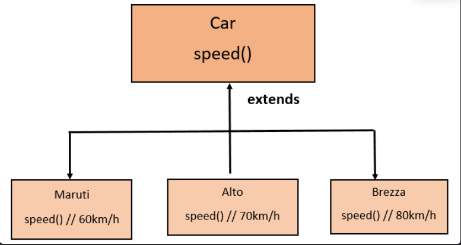
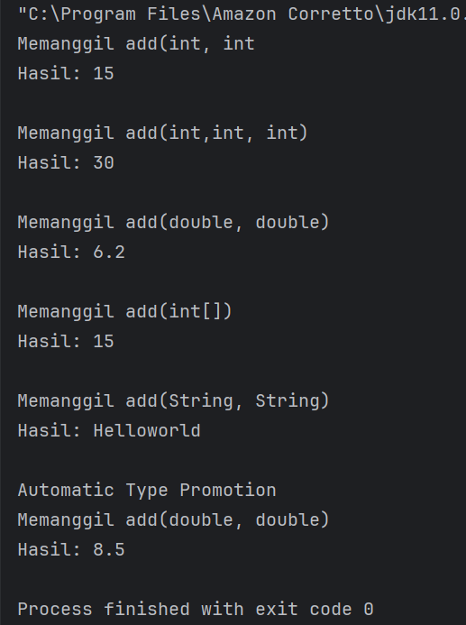
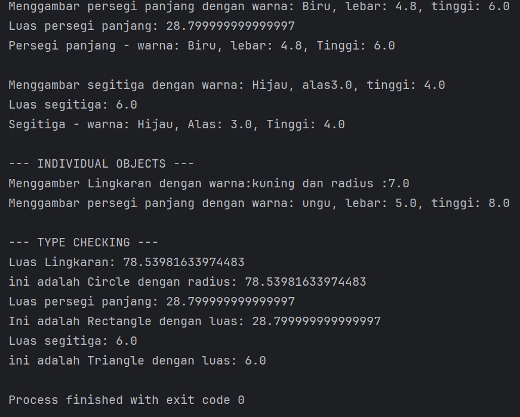

# LAPORAN PRAKTIKUM 7 : POLYMORPHISM    
---

***Nama: Muhammad Zakyurrahman***

***NIM: 2024573010119***

***Kelas: TI 2A***

---

## 1. Abstrak
   Polymorphism merupakan salah satu pilar utama dalam Pemrograman Berorientasi Objek (PBO) yang
   memungkinkan suatu objek memiliki banyak bentuk atau perilaku berbeda tergantung pada konteks penggunaannya. Dalam bahasa
   pemrograman Java, konsep ini diwujudkan melalui kemampuan kelas turunan (subclass) untuk mengubah atau menyesuaikan perilaku
   dari kelas induknya (superclass) menggunakan method overriding, serta kemampuan untuk memanggil metode yang sama
   namun menghasilkan hasil berbeda tergantung jenis objek sebenarnya pada saat runtime.
   Praktikum ini bertujuan untuk memahami secara mendalam bagaimana polymorphism bekerja dalam Java, baik melalui
   compile-time polymorphism (method overloading) maupun runtime polymorphism (method overriding). Melalui penerapan
   konsep ini, mahasiswa diharapkan mampu merancang program yang lebih fleksibel, efisien, dan mudah
   diperluas tanpa harus memodifikasi struktur kelas yang sudah ada.
   Dengan memanfaatkan polymorphism, sistem menjadi lebih dinamis karena satu referensi objek dapat
   mewakili berbagai tipe kelas turunan. Hal ini tidak hanya meningkatkan reusability dan maintainability,
   tetapi juga mencerminkan prinsip utama OOP, yaitu kemampuan objek untuk menyesuaikan perilakunya terhadap situasi 
   yang berbeda.
   Praktikum ini sekaligus menegaskan bahwa polymorphism merupakan fondasi penting dalam membangun aplikasi yang
   modular, scalable, dan mudah dikembangkan di masa depan.

---

## 2. Praktikum
### Pendahuluan
  Dalam konteks pemrograman OOP (Object Oriented Programming), istilah polymorphism sering digunakan karena berkaitan erat
  dengan salah satu pilar seperti class, object, method, atau inheritance. Polymorphism adalah banyak bentuk
  atau bermacam-macam. Dalam istilah pemrograman, polymorphism adalah sebuah konsep di mana sebuah interface tunggal 
  digunakan pada entitas yang berbeda-beda. Umumnya, penggunaan suatu simbol tunggal berfungsi untuk mewakili
  beberapa jenis tipe entitas.
  Polymorphism adalah konsep pemrograman yang berorientasi pada objek yang mengacu pada kemampuan variabel, fungsi atau
  objek untuk mengambil beberapa bentuk. Polymorphism adalah penggunaan salah satu item seperti fungsi, atribut, atau
  interface pada berbagai jenis objek yang berbeda dalam bahasa pemrograman. Dalam bahasa pemrograman yang menunjukkan
  polimorfisme, objek kelas miliki hierarki yang sama yang diwariskan dari kelas induk yang sama, mungkin
  memiliki fungsi dengan nama yang sama, tetapi dengan perilaku berbeda.


#### Tujuan Polymorphism
1. Flexibility - Memungkinkan kode yang lebih fleksibel dan mudah diperluas.
2. Code Reusability - Mengurangi duplikasi kode dengan menggunakan interface yang sama.
3. Maintainability - Memudahkan maintenance dan pengembangan fitur baru.
4. Dynamic Behavior - Perilaku objek ditentukan pada runtime
5. Interface Consistency - Konsistensi dalam penggunaan interface
  
#### Cara Implementasi
1. Gunakan inheritance hierarchy
2. Override method di subclass
3. Gunakan reference superclass untuk memegang objek subclass
4. Method yang dipanggil ditentukan pada runtime berdasarkan tipe aktual objek

#### Jenis-jenis Polimorfisme:
### 1. Compile-time Polymorphism (Method Overloading)
   Method overriding terjadi ketika subclass (class anak) menyediakan implementasi spesifik untuk method yang sudah
   didefinisikan di superclass (class induk). Method overriding digunakan untuk mengubah atau memperluas
   perilaku method yang diwarisi dari superclass. Method yang di-override harus memiliki nama, parameter, dan return type yang
   sama dengan method di superclass.
   
#### Aturan Method Overriding:
   - Method harus memiliki nama dan parameter yang sama dengan method di superclass.
   - Return type harus sama atau subtype dari return type di superclass.
   - Access modifier tidak boleh lebih restriktif daripada method di superclass (misalnya, jika method di superclass
   protected, method di subclass bisa protected atau public).
   - Method tidak bisa di-override jika di superclass dideklarasikan sebagai final.

### 2. Runtime Polymorphism (Method Overriding)
   Runtime polymorphism terjadi ketika sebuah method di-override oleh subclass untuk memberikan implementasi yang lebih
   spesifik dari method yang sama yang didefinisikan di superclass.
   Pemilihan method mana yang akan dijalankan tidak dilakukan oleh compiler, tetapi oleh Java Virtual Machine
   (JVM) saat program dijalankan.
   
#### Aturan Method Overriding:
- Nama dan parameter method harus identik dengan method di superclass.
- Return type harus sama, atau merupakan subtype dari return type di superclass (covariant return type).
- Access modifier tidak boleh lebih restriktif daripada di superclass.
   - Contoh: Jika method di superclass protected , maka di subclass bisa protected atau public , tetapi tidak
   private .
- Method tidak bisa di-override jika:
   - Dideklarasikan sebagai final atau static .
   - Termasuk konstruktor.

---

## Praktikum 1: Memahami Method Overloading (Compile-time Polymorphism)
#### Tujuan:
Memahami konsep dan implementasi method overloading.

### Langkah Praktikum 1 : Method Overloading (Compile-time Polymorphism)
1. Buat class `Calculator`
2. Ketik kode:
````
package modul_7.praktikum1;

public class Calculator {
    public int add(int a, int b){
        System.out.println("Memanggil add(int, int");
        return a + b;
    }

    public int add(int a, int b, int c){
        System.out.println("Memanggil add(int,int, int)");
        return a + b + c;
    }

    public double add(double a ,double b){
        System.out.println("Memanggil add(double, double)");
        return a + b;
    }

    public int add(int[] numbers){
        System.out.println("Memanggil add(int[])");
        int sum = 0;
        for (int num : numbers){
            sum += num;
        }
        return sum;
    }

    public String add(String a, String b){
        System.out.println("Memanggil add(String, String)");
        return a + b;
    }
}
````
- Buat class `OverloadingTest` untuk testing:
````
package modul_7.praktikum1;

public class OverloadingTest {
    public static void main(String[] args){
        Calculator calc = new Calculator();

        System.out.println("Hasil: " + calc.add(5, 10));
        System.out.println();

        System.out.println("Hasil: " + calc.add(5, 10, 15));
        System.out.println();

        System.out.println("Hasil: " + calc.add(3.5, 2.7));
        System.out.println();

        int[] numbers = {1, 2, 3, 4, 5};
        System.out.println("Hasil: " + calc.add(numbers));
        System.out.println();

        System.out.println("Hasil: " + calc.add("Hello", "world"));
        System.out.println();

        System.out.println("Automatic Type Promotion");
        System.out.println("Hasil: " + calc.add(5, 3.5));
    }

}
````
- Jalankan programnya:

***Screenshot Hasil***


### Pembahasan
#### Konsep yang Diuji: Compile-time Polymorphism
Program ini menampilkan bagaimana Java mampu menentukan method mana yang dijalankan berdasarkan
tipe dan jumlah
parameter saat kompilasi. Tidak ada mekanisme dinamis (runtime dispatch) seperti pada overriding.

#### Keuntungan method overloading:
- ***Konsistensi nama method***: tidak perlu membuat banyak nama berbeda untuk fungsi serupa.
- Meningkatkan keterbacaan kode: programmer cukup mengingat satu nama method (add) untuk
berbagai tipe operasi.
- ***Mendukung fleksibilitas***: method yang sama dapat bekerja untuk berbagai tipe data.
  
#### Automatic Type Promotion
  Fitur ini menunjukkan bahwa Java dapat secara otomatis mengonversi tipe data yang lebih kecil ke tipe yang lebih besar
  jika diperlukan.
  
Contoh:
  - int - double
  - float - double
  - char - int

Sehingga, pemanggilan calc.add(5, 3.5) akan diarahkan ke add(double, double) karena Java menaikkan tipe int
  menjadi double .

---

## Praktikum 2: Memahami Method Overriding (RuntimePolymorphism)
#### Tujuan:
Memahami konsep runtime polymorphism melalui method overriding.

### Langkah Praktikum 2 : Method Overriding (Runtime Polymorphism)
1. Buat class baru `Shape` sebagai superclass.
2. Ketik kode:
````
package modul_7.praktikum2;

public class Shape {
    protected  String color;

    public Shape(String color){
        this.color = color;
    }

    public void draw(){
        System.out.println("Menggambar shape dengan warna : " + color);
    }

    public double calculateArea(){
        System.out.println("Menghitung luas shape umum");
        return 0.0;
    }

    public void displayInfo(){
        System.out.println("Shape - Warna: " + color);
    }
}
````
- Buat class `Circle` yang mewarisi Shape:
````
package modul_7.praktikum2;

public class Circle extends Shape{
    private double radius;

    public Circle(String color, double radius){
        super(color);
        this.radius = radius;
    }

    @Override
    public void draw(){
        System.out.println("Menggamber Lingkaran dengan warna:" + color + " dan radius :" + radius);
    }

    @Override
    public double calculateArea(){
        double area = Math.PI * radius * radius;
        System.out.println("Luas Lingkaran: " + area);
        return area;
    }

    @Override
    public void displayInfo(){
        System.out.println("Lingkaran - warna: " + color + ", radius: " + radius);
    }
}
````
- Buat class `Rectangle` untuk mewarisi Shape:
````
package modul_7.praktikum2;

public class Rectangle extends Shape{
    private double width;
    private double height;

    public Rectangle(String color, double width, double height){
        super(color);
        this.width = width;
        this.height = height;
    }

    @Override
    public void draw(){
        System.out.println("Menggambar persegi panjang dengan warna: " + color + ", lebar: " + width + ", tinggi: " + height);
    }

    @Override
    public double calculateArea(){
        double area = width * height;
        System.out.println("Luas persegi panjang: " + area);
        return area;
    }

    @Override
    public void displayInfo(){
        System.out.println("Persegi panjang - warna: " + color + ", lebar: " + width + ", Tinggi: " + height);
    }

}
````
- Buat class `Triangle` untuk mewarisi Shape:
````
package modul_7.praktikum2;

public class Triangle extends Shape{
    private double base;
    private double height;

    public Triangle(String color, double base, double height){
        super(color);
        this.base = base;
        this.height = height;
    }

    @Override
    public void draw(){
        System.out.println("Menggambar segitiga dengan warna: " + color + ", alas" + base + ", tinggi: " + height);
    }

    @Override
    public double calculateArea() {
        double area = 0.5 * base * height;
        System.out.println("Luas segitiga: " + area);
        return area;
    }

    @Override
    public void displayInfo() {
        System.out.println("Segitiga - warna: " + color + ", Alas: " + base + ", Tinggi: " + height);
    }
}
````
- Buat class `PlymorphismTest` untuk testing:
````
package modul_7.praktikum2;

public class PolymorphismTest {
    public static void main(String[] args){
        Shape[] shapes = new Shape[3];
        shapes[0] = new Circle("Merah", 5.0);
        shapes[1] = new Rectangle("Biru", 4.8, 6.0);
        shapes[2] = new Triangle("Hijau", 3.0, 4.0);

        System.out.println("--- POLIMORFISME RUNTIME ---");
        for (Shape shape : shapes) {
            shape.draw();
            shape.calculateArea();
            shape.displayInfo();
            System.out.println();
        }

        System.out.println("--- INDIVIDUAL OBJECTS ---");
        Shape shape1 = new Circle("kuning", 7.0);
        Shape shape2 = new Rectangle("ungu", 5.0, 8.0);

        shape1.draw();
        shape2.draw();

        System.out.println("\n--- TYPE CHECKING ---");
        for (Shape shape : shapes){
            if (shape instanceof Circle){
                Circle circle = (Circle) shape;
                System.out.println("ini adalah Circle dengan radius: " + circle.calculateArea());
            } else if (shape instanceof  Rectangle) {
                Rectangle rectangel = (Rectangle) shape;
                System.out.println("Ini adalah Rectangle dengan luas: " + rectangel.calculateArea());
            } else if (shape instanceof Triangle) {
                Triangle triangle = (Triangle) shape;
                System.out.println("ini adalah Triangle dengan luas: " + triangle.calculateArea());
            }
        }
    }
}
````
- Jalankan Program
- Bagaimana method yang dipanggil ditentukan pada runtime
- Perilaku polimorfik dari objek-objek berbeda
- Penggunaan instanceof untuk type checking

***Screenshot Hasil***


### Pembahasan
Program ini menerapkan konsep ***runtime polymorphism*** melalui ***method overriding*** pada hierarki class `Shape`. 
Kelas `Shape` berperan sebagai superclass yang menyediakan atribut `color` serta method dasar seperti `draw()`,`calculateArea()`,
dan `displayInfo()` yang nantinya dioverride oleh subclass.

Subclass `Circle`, `Rectangle`, dan `Triangle` masing-masing mengoverride method tersebut untuk memberikan implementasi 
sesuai bentuknya. Misalnya, `Circle` menghitung luas lingkaran menggunakan rumus πr², `Rectangle` menghitung luas dari 
perkalian width × height, sedangkan `Triangle` menggunakan rumus 0.5 × base × height. Perbedaan implementasi inilah yang 
menunjukkan bahwa satu method yang sama dapat menghasilkan perilaku berbeda tergantung objek yang memanggilnya.

Pada kelas PolymorphismTest, objek-objek disimpan dalam array bertipe Shape. Saat loop dijalankan, method yang 
terpanggil adalah milik subclass masing-masing, bukan milik superclass, yang menunjukkan proses dynamic method dispatch 
sebagai ciri utama polymorphism runtime. Program juga menggunakan instanceof untuk mengecek tipe objek sebenarnya 
sehingga dapat dilakukan casting dan pemanggilan method spesifik sesuai tipe objek.

Secara keseluruhan, program ini menunjukkan bahwa polymorphism memungkinkan penggunaan referensi superclass untuk objek
subclass sehingga kode menjadi lebih fleksibel, terstruktur, dan mudah diperluas.

---

## 3. Kesimpulan
   Berdasarkan hasil praktikum dan analisis yang telah dilakukan pada materi ***Polymorphism*** di Java, dapat
   disimpulkan beberapa hal penting sebagai berikut:
1. ***Polymorphism*** adalah salah satu pilar utama dalam pemrograman berorientasi objek (OOP) yang
   memungkinkan satu referensi superclass untuk digunakan dalam memanggil method dari berbagai
   subclass yang berbeda.
   Hal ini memberikan ***fleksibilitas tinggi*** dalam desain program dan mempermudah pengelolaan objek
   dengan perilaku yang berbeda namun memiliki antarmuka yang sama.
2. ***Runtime Polymorphism (Dynamic Polymorphism)*** terjadi ketika penentuan method yang dijalankan
   dilakukan saat program berjalan, bukan saat kompilasi.
   Dalam percobaan ini, hal tersebut terlihat pada pemanggilan method draw() , calculateArea() , dan
   displayInfo() yang hasilnya bergantung pada tipe objek aktual ( Circle , Rectangle , atau Triangle )
   meskipun direferensikan oleh variabel bertipe Shape .
3. ***Method Overriding*** menjadi kunci utama dalam penerapan runtime polymorphism, karena subclass
   dapat menimpa (override) method dari superclass untuk memberikan perilaku yang lebih spesifik
   sesuai kebutuhan masing-masing kelas turunan.
4. Dengan menggunakan ***polymorphism***, program menjadi lebih modular, efisien, dan mudah
   dikembangkan, karena penambahan kelas baru (misalnya bentuk baru selain `Circle` , `Rectangle` ,
   dan `Triangle` ) tidak memerlukan perubahan besar pada struktur kode yang sudah ada.
5. Fitur `instanceof` dan type casting pada Java berperan penting dalam memastikan keamanan saat
   berinteraksi dengan objek polymorphic, terutama untuk mengetahui tipe sebenarnya dari suatu objek
   sebelum dilakukan operasi tertentu.
   
Secara keseluruhan, praktikum ini membuktikan bahwa polymorphism memungkinkan kode yang lebih
dinamis dan adaptif, serta merupakan pondasi penting dalam membangun sistem berorientasi objek yang
berskala besar, fleksibel, dan mudah dipelihara.

---

## 4. Referensi
   Oracle. Java SE Documentation. https://docs.oracle.com/javase
   Modul Praktikum PBO, Modul 2: Dasar Pemrograman Java
   Oracle. (2024). The Java™ Tutorials: Polymorphism.
   Diakses dari: https://docs.oracle.com/javase/tutorial/java/IandI/polymorphism.html
   Deitel, P. J., & Deitel, H. M. (2022). Java: How to Program (Early Objects), 12th Edition. Pearson Education.
   Schildt, H. (2022). Java: The Complete Reference, 12th Edition. McGraw-Hill Education.
   Wicaksono, A. (2021). Pemrograman Berorientasi Objek dengan Java. Elex Media Komputindo.