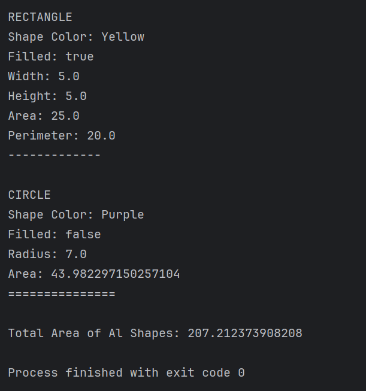
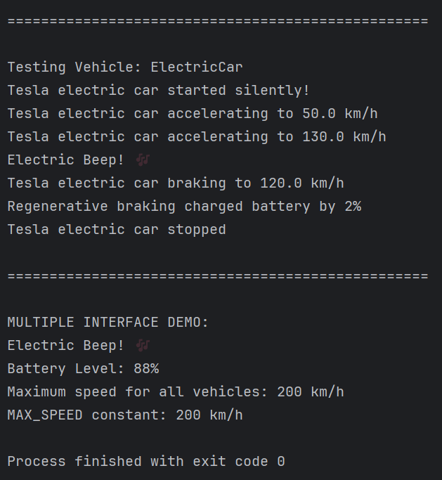
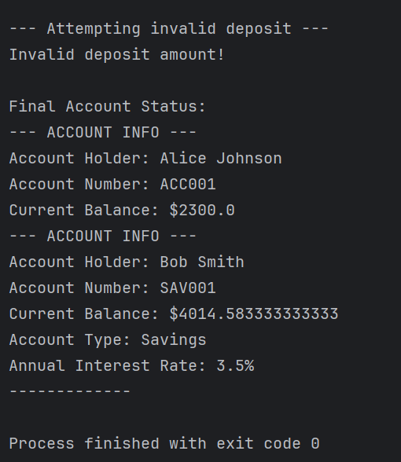

# Laporan Modul 8: Abstraction
**Mata Kuliah:** Praktikum Pemrograman Berorientasi Objek   
**Nama:** Muhammad Zakyurrahman  
**NIM:** 2024573010119
**Kelas:** TI 2A

---

## BAB I - PENDAHULUAN

### 1.1 Latar Belakang

&emsp;&emsp;Abstraksi adalah konsep dalam object-oriented programming (OOP) yang bertujuan untuk menyederhanakan kompleksitas sistem dengan menyembunyikan detail-detail teknis yang tidak perlu.

&emsp;&emsp;Inti dari abstraksi adalah tentang fokus pada 'apa' yang dilakukan suatu objek atau komponen, bukan 'bagaimana' hal itu dilakukan. Dalam praktiknya, abstraksi membantu programmer mendefinisikan interface, menunjukkan operasi yang dapat dilakukan oleh suatu objek, tanpa harus menyertakan detail tentang logika internal atau implementasi di balik operasi tersebut.

&emsp;&emsp;Misalnya, ketika menggunakan remote TV, kita hanya perlu tahu cara mengoperasikannya tanpa harus memahami mekanisme internalnya. Dalam OOP, objek menyediakan abstraksi yang menyembunyikan detail implementasi internal. Seperti remote TV, user hanya perlu tahu metode apa dari objek yang tersedia untuk dipanggil dan parameter input apa yang diperlukan untuk memicu operasi tertentu.

&emsp;&emsp;Dalam desain software, abstraksi berguna agar sistem dapat dibagi menjadi komponen-komponen yang lebih kecil dan lebih mudah dikelola, di mana masing-masing menyembunyikan kompleksitasnya sendiri. Hal ini tidak hanya memudahkan proses pengembangan, tetapi juga memfasilitasi maintenance dan testing software.

&emsp;&emsp;Selain itu, abstraksi juga bisa dipakai untuk mengubah implementasi internal suatu komponen tanpa memengaruhi komponen lain yang berinteraksi dengan komponen tersebut, asalkan interface yang digunakan tetap konsisten.

### 1.2 Fungsi Abstraksi

1. Menyederhanakan kompleksitas: abstraksi membantu dalam menyederhanakan sistem yang kompleks. Dengan menyembunyikan detail internal dan menampilkan hanya fungsionalitas yang diperlukan, abstraksi membantu programmer untuk tidak terbebani oleh kompleksitas yang tidak relevan.
2. Meningkatkan modularitas: abstraksi mendukung pembuatan modul yang dapat digunakan kembali. Dengan mendefinisikan interface yang jelas, modul dapat dikembangkan secara independen dan digunakan dalam berbagai konteks tanpa perlu mengetahui detail internalnya.
3. Memudahkan maintenance: kode yang mengimplementasikan abstraksi lebih mudah dipelihara dan diperbarui. Perubahan pada implementasi internal suatu modul tidak memengaruhi modul lain yang menggunakan interface abstrak tersebut.
4. Meningkatkan keamanan: dengan menyembunyikan detail internal, abstraksi akan meningkatkan keamanan software. Hal ini mencegah akses tidak sah ke data internal atau manipulasi fungsi internal.
5. Memfasilitasi kolaborasi: dalam proyek besar dengan banyak developer, abstraksi memungkinkan tim untuk bekerja secara paralel pada komponen yang berbeda. Setiap tim fokus pada tugasnya sendiri tanpa perlu memahami keseluruhan sistem.
6. Mendukung polimorfisme dan penggunaan ulang kode: abstraksi mendukung penggunaan polimorfisme, di mana objek dari class berbeda dapat diakses melalui interface yang sama. Ini meningkatkan fleksibilitas dan penggunaan ulang kode.
7. Mendukung pemisahan antara interface dan implementasi: abstraksi bisa memisahkan apa yang dilakukan suatu objek (interface) dan bagaimana hal itu dilakukan (implementasi). Ini memudahkan pemahaman dan pengembangan software.

### 1.3 Jenis-jenis Abstraksi
#### 1.3.1 Abstraksi data (data abstraction)

&emsp;&emsp;Data abstraction terjadi ketika data objek tidak terlihat oleh dunia luar. Akses ke data objek (jika diperlukan) disediakan melalui beberapa metode. Abstraksi data memastikan detail internal objek tetap tersembunyi, sementara fungsionalitas yang diperlukan dapat diakses.

#### 1.3.2 Abstraksi proses (process abstraction)

&emsp;&emsp;Process abstraction terjadi ketika implementasi internal dari berbagai fungsi yang terlibat dalam operasi user disembunyikan. Artinya, detail tentang bagaimana fungsi tertentu diimplementasikan tidak terlihat oleh user, hanya hasil akhirnya yang penting.

### 1.4 Contoh Abstraksi

&emsp;&emsp;Contoh dari abstraksi adalah penggunaan aplikasi pengolah kata, seperti Microsoft Word. Microsoft Word adalah aplikasi pengolah kata untuk membuat, mengedit, dan memformat dokumen teks. Aplikasi ini menyediakan berbagai fitur seperti pengecekan ejaan dan tata bahasa, format teks, penambahan gambar, dan pembuatan tabel.

Beberapa fitur yang ditawarkan Microsoft Word yaitu:

1. Pembuatan dan pengeditan Dokumen
2. Pengecekan ejaan dan tata bahasa
3. Insert object
4. Template dan desain dokumen

&emsp;&emsp;Microsoft Word mengabstraksikan kompleksitas pemrosesan fitur-fitur di atas. User tidak perlu memahami detail teknis tentang pemformatan teks atau pengelolaan dokumen. Sebaliknya, mereka hanya perlu menggunakan user interface intuitif untuk mencapai hasil yang diinginkan. Proses seperti rendering teks, penanganan margin dan spasi, serta konversi format file, semua diabstraksikan oleh aplikasi.

### 1.5 Cara Implementasi

1. Abstract Classes - Class yang tidak dapat diinstansiasi langsung dan mengandung abstract methods
2. Interfaces - Kontrak yang mendefinisikan method yang harus diimplementasikan
3. Access Modifiers - Menggunakan private/protected untuk menyembunyikan detail implementasi

---

## BAB II - PRAKTIKUM
### 2.1 Praktikum 1 - Memahami Abstract Class dan Abstract Method
#### 2.1.1 Abstract Class

&emsp;&emsp;Abstract class adalah kelas yang tidak dapat diinstansiasi (tidak bisa dibuat objeknya langsung). Kelas ini berfungsi sebagai kerangka dasar (template) untuk kelas-kelas turunannya.

**Ciri-ciri Abstract Class:**
* Dideklarasikan dengan keyword abstract
* Tidak bisa dibuat objeknya dengan new
* Dapat memiliki method abstrak dan method konkret (biasa)
* Dapat memiliki constructor, field, dan method seperti kelas biasa

#### 2.1.2 Abstract Method

&emsp;&emsp;Abstract method adalah method yang hanya dideklarasikan tanpa implementasi (tanpa body). Implementasinya wajib diberikan oleh subclass yang mewarisinya.

**Ciri-ciri Abstract Method:**
* Hanya deklarasi tanpa body {}
* Harus berada dalam abstract class
* Subclass wajib mengoverride method abstrak ini
* Dideklarasikan dengan keyword abstract

#### 2.1.3 Tujuan

&emsp;&emsp;Memahami konsep dan implementasi abstract class dan abstract method.

#### 2.1.4 Langkah Praktikum
1. Buat sebuah package baru di dalam package `modul_8` dengan nama `praktikum_1`
2. Buat abstract class `Shape`:
`
package modul_8.praktikum_1;

public abstract class Shape {
    protected String color;
    protected boolean filled;
    
    // Constructor
    public Shape(String color, boolean filled) {
        this.color = color;
        this.filled = filled;
    }
    
    // Abstract methods
    public abstract double calculateArea();
    public abstract double calculatePerimeter();
    
    // Concrete methods
    public String getColor() {
        return color;
    }
    
    public void setColor(String color) {
        this.color = color;
    }
    
    public boolean isFilled() {
        return filled;
    }
    
    public void setFilled(boolean filled) {
        this.filled = filled;
    }
    
    public void displayInfo() {
        System.out.println("Shape Color: " + color);
        System.out.println("Filled: " + filled);
    }
}
`

3. Buat class `Circle` yang mewarisi `Shape`:
`declarative
package modul_8.praktikum_1;

public class Circle extends Shape {
    private double radius;
    
    public Circle(String color, boolean filled, double radius) {
        super(color, filled);
        this.radius = radius;
    }
    
    // Implementasi abstract methods
    @Override
    public double calculateArea() {
        return Math.PI * radius * radius;
    }
    
    @Override
    public double calculatePerimeter() {
        return 2 * Math.PI * radius;
    }
    
    // Override display method
    @Override
    public void displayInfo() {
        System.out.println("CIRCLE");
        super.displayInfo();
        System.out.println("Radius: " + radius);
        System.out.println("Area: " + calculateArea());
        System.out.println("Perimeter: " + calculatePerimeter());
        System.out.println("===============");
    }
    
    // Method khusus
    public double getDiameter() {
        return 2 * radius;
    }
}
`
4. Buat class `Rectangle` yang mewarisi `Shape`:
`declarative
package modul_8.praktikum_1;

public class Rectangle extends Shape {
    private double width;
    private double height;
    
    public Rectangle(String color, boolean filled, double width, double height) {
        super(color, filled);
        this.width = width;
        this.height = height;
    }
    
    @Override
    public double calculateArea() {
        return width * height;
    }
    
    @Override
    public double calculatePerimeter() {
        return 2 * (width + height);
    }
    
    @Override
    public void displayInfo() {
        System.out.println("RECTANGLE");
        super.displayInfo();
        System.out.println("Width: " + width);
        System.out.println("Height: " + height);
        System.out.println("Area: " + calculateArea());
        System.out.println("Perimeter: " + calculatePerimeter());
        System.out.println("-----------------------");
    }
    
    public boolean isSquare() {
        return width == height;
    }
}
`
5. Buat class `AbstractClassTest` untuk testing:
`declarative
package modul_8.praktikum_1;

public class AbstractClassTest {
    public static void main(String[] args) {

        Circle circle = new Circle("Red", true, 5.0);
        Rectangle rectangle = new Rectangle("Blue", false, 4.0, 6.0);

        System.out.println("DEMONSTRASI ABSTRACT CLASS");

        Shape shape1 = circle;
        Shape shape2 = rectangle;

        shape1.displayInfo();
        System.out.println();

        shape2.displayInfo();
        System.out.println();

        System.out.println("Circle Diameter: " + circle.getDiameter());
        System.out.println("Is Rectangle Square? " + rectangle.isSquare());

        System.out.println("\nARRAY OF SHAPES");
        Shape[] shapes = new Shape[3];
        shapes[0] = new Circle("Green", true, 3.0);
        shapes[1] = new Rectangle("Yellow", true, 5.0, 5.0);
        shapes[2] = new Circle("Purple", false, 7.0);

        double totalArea = 0;
        for (Shape shape : shapes) {
            shape.displayInfo();
            totalArea += shape.calculateArea();
            System.out.println();
        }

        System.out.println("Total Area of All Shapes: " + totalArea);
    }
}
`

6. Jalankan program dan amati hasilnya.
7. Coba buat instance abstract class langsung dan lihat error yang terjadi.

#### 2.1.5 Hasil Praktikum

### 2.2 Praktikum 2 - Memahami Interface
#### 2.2.1 Interface

&emsp;&emsp;Interface adalah kontrak yang mendefinisikan method yang harus diimplementasikan oleh class yang menggunakannya. Interface hanya berisi deklarasi method tanpa implementasi (kecuali default dan static methods di Java 8+).

**Karakteristik Interface:**
* Semua method secara default abstract dan public.
* Semua variables secara default public, static, dan final.
* Mendukung multiple inheritance.
* Dapat memiliki default dan static methods.
* Dapat memiliki private methods.

#### 2.2.2 Tujuan

&emsp;&emsp;Memahami konsep dan implementasi interface.

#### 2.2.3 Langkah Praktikum

1. Buat sebuah package baru di dalam package `modul_8` dengan nama `praktikum_2`
2. Buat interface `Vehicle`:
`declarative
package modul_8.praktikum_2;

public interface Vehicle {
    // Constant fields (public static final by default)
    int MAX_SPEED = 200;
    
    // Abstract methods (public abstract by default)
    void start();
    void stop();
    void accelerate(double speed);
    void brake();
    
    // Default method (Java 8+)
    default void honk() {
        System.out.println("Beep beep!");
    }
    
    // Static method (Java 8+)
    static void displayMaxSpeed() {
        System.out.println("Maximum speed for all vehicles: " + MAX_SPEED + " km/h");
    }
}
`

3. Buat interface `Electric`:
`declarative
package modul_8.praktikum_2;

public interface Electric {
    void charge();
    int getBatteryLevel();
    void setBatteryLevel(int level);
    
    default void displayBatteryInfo() {
        System.out.println("Battery Level: " + getBatteryLevel() + "%");
    }
}
`

4. Buat class `Car` yang mengimplementasi `Vehicle`:
`declarative
package modul_8.praktikum_2;

public class Car implements Vehicle {
    private String brand;
    private double currentSpeed;
    private boolean isRunning;
    
    public Car(String brand) {
        this.brand = brand;
        this.currentSpeed = 0;
        this.isRunning = false;
    }
    
    @Override
    public void start() {
        if (!isRunning) {
            isRunning = true;
            System.out.println(brand + " car started");
        } else {
            System.out.println(brand + " car is already running");
        }
    }
    
    @Override
    public void stop() {
        if (isRunning) {
            isRunning = false;
            currentSpeed = 0;
            System.out.println(brand + " car stopped");
        } else {
            System.out.println(brand + " car is already stopped");
        }
    }
    
    @Override
    public void accelerate(double speed) {
        if (isRunning) {
            currentSpeed += speed;
            if (currentSpeed > MAX_SPEED)
            currentSpeed = MAX_SPEED;
        
            System.out.println(brand + " car accelerating to " + currentSpeed + " km/h");
        } else {
            System.out.println("Please start the car first");
        }
    }
    
    @Override
    public void brake() {
        if (currentSpeed > 0) {
            currentSpeed -= 10;
            if (currentSpeed < 0) currentSpeed = 0;
            
            System.out.println(brand + " car braking to " + currentSpeed + " km/h");
        } else {
            System.out.println(brand + " car is already stopped");
        }
    }
    
    // Getter methods
    public String getBrand() { return brand; }
    public double getCurrentSpeed() { return currentSpeed; }
    public boolean isRunning() { return isRunning; }
}
`

5. Buat class `ElectricCar` yang mengimplementasi kedua interface:
`declarative
package modul_8.praktikum_2;

public class ElectricCar implements Vehicle, Electric {
    private String brand;
    private double currentSpeed;
    private boolean isRunning;
    private int batteryLevel;

    public ElectricCar(String brand) {
        this.brand = brand;
        this.currentSpeed = 0;
        this.isRunning = false;
        this.batteryLevel = 100; // Fully charged
    }

    // Implement Vehicle interface methods
    @Override
    public void start() {
        if (batteryLevel > 0) {
            if (!isRunning) {
                isRunning = true;
                System.out.println(brand + " electric car started silently");
            } else {
                System.out.println(brand + " electric car is already running");
            }
        } else {
            System.out.println("Cannot start the car. Battery is empty. Please charge first.");
        }
    }

    @Override
    public void stop() {
        if (isRunning) {
            isRunning = false;
            currentSpeed = 0;
            System.out.println(brand + " electric car stopped");
        } else {
            System.out.println(brand + " electric car is already stopped");
        }
    }

    @Override
    public void accelerate(double speed) {
        if (isRunning && batteryLevel > 0) {
            currentSpeed += speed;

            // Battery consumption
            batteryLevel -= (int)(speed / 10);
            if (batteryLevel < 0) batteryLevel = 0;

            if (currentSpeed > MAX_SPEED) currentSpeed = MAX_SPEED;

            System.out.println(brand + " electric car accelerating to " + currentSpeed + " km/h");
            System.out.println("Battery level now: " + batteryLevel + "%");
        } else {
            System.out.println("Please start the car first");
        }
    }

    @Override
    public void brake() {
        if (currentSpeed > 0) {
            currentSpeed -= 10;
            if (currentSpeed < 0) currentSpeed = 0;

            System.out.println(brand + " electric car braking to " + currentSpeed + " km/h");

            // Regenerative braking: battery gains slightly
            batteryLevel += 2;
            if (batteryLevel > 100) batteryLevel = 100;

            System.out.println("Regenerative braking charged battery by 2%");
        } else {
            System.out.println(brand + " electric car is already stopped");
        }
    }

    // Override default method
    @Override
    public void honk() {
        System.out.println("Electric beep! ⚡");
    }

    // Electric interface methods
    @Override
    public void charge() {
        batteryLevel = 100;
        System.out.println(brand + " electric car fully charged");
    }

    @Override
    public int getBatteryLevel() {
        return batteryLevel;
    }

    @Override
    public void setBatteryLevel(int level) {
        if (level >= 0 && level <= 100) {
            batteryLevel = level;
        } else {
            System.out.println("Battery level must be between 0 and 100%");
        }
    }

    public String getBrand() { return brand; }
    public double getCurrentSpeed() { return currentSpeed; }
    public boolean isRunning() { return isRunning; }
}
`

6. Buat class `InterfaceTest` untuk testing:
`declarative
package modul_8.praktikum_2;

public class InterfaceTest {
    public static void main(String[] args) {
        System.out.println("DEMOSTRASI INTERFACE");

        // Test regular car
        Car car = new Car("Toyota");
        testVehicle(car);

        System.out.println("\n" + "=".repeat(50) + "\n");

        // Test electric car
        ElectricCar electricCar = new ElectricCar("Tesla");
        testVehicle(electricCar);
        testElectric(electricCar);

        System.out.println("\n" + "=".repeat(50) + "\n");

        // Demonstrasi multiple interface implementation
        System.out.println("MULTIPLE INTERFACE DEMO");
        electricCar.honk(); // Overridden default method
        electricCar.displayBatteryInfo(); // Default method from Electric interface

        // Static method call
        Vehicle.displayMaxSpeed();

        // Interface constants
        System.out.println("MAX_SPEED constant: " + Vehicle.MAX_SPEED + " km/h");
    }

    public static void testVehicle(Vehicle vehicle) {
        System.out.println("Testing Vehicle: " + vehicle.getClass().getSimpleName());
        vehicle.start();
        vehicle.accelerate(50);
        vehicle.accelerate(80);
        vehicle.honk(); // Default method
        vehicle.brake();
        vehicle.stop();
    }

    public static void testElectric(Electric electric) {
        System.out.println("Testing Electric Features:");
        electric.displayBatteryInfo();
        electric.charge();
        electric.displayBatteryInfo();
    }
}
`

7. Jalankan program dan amati:
* Implementasi multiple interface
* Penggunaan default dan static methods
* Perbedaan antara abstract class dan interface

#### 2.2.4 Screenshoot Hasil

### 2.3 Praktikum 3 - Abstraksi dengan Access Modifiers
#### 2.3.1 Tujuan

&emsp;&emsp;Memahami bagaimana access modifiers membantu dalam mencapai abstraksi.

#### 2.3.2 Langkah Praktikum
1. Buat sebuah package baru di dalam package `modul_8` dengan nama `praktikum_3`
2. Buat class `BankAccount` yang mengimplementasi abstraksi:
`declarative
package modul_8.praktikum_3;

public class BankAccount {
    // Private fields - hidden from outside world
    private String accountNumber;
    private String accountHolder;
    private double balance;
    private String password;
    
    // Constructor
    public BankAccount(String accountNumber, String accountHolder, double initialBalance, String password) {
        this.accountNumber = accountNumber;
        this.accountHolder = accountHolder;
        this.balance = initialBalance;
        this.password = password;
    }
    
    // Public method - interface to the outside world
    public double getBalance() {
        return balance;
    }
    
    public String getAccountNumber() {
        return accountNumber;
    }
    
    public String getAccountHolder() {
        return accountHolder;
    }
    
    public void deposit(double amount) {
        if (amount > 0) {
            balance += amount;
            System.out.println("Successfully deposited: " + amount);
            logTransaction("DEPOSIT", amount);
        } else {
            System.out.println("Invalid deposit amount");
        }
    }
    
    public boolean withdraw(double amount, String inputPassword) {
        if (authenticate(inputPassword)) {
            if (amount > 0 && amount <= balance) {
                balance -= amount;
                System.out.println("Successfully withdrawn: " + amount);
                logTransaction("WITHDRAW", amount);
                return true;
            } else {
                System.out.println("Invalid withdraw amount or insufficient funds");
            }
        } else {
            System.out.println("Authentication failed!");
        }
        return false;
    }
    
    public boolean transfer(BankAccount recipient, double amount, String inputPassword) {
        if (authenticate(inputPassword)) {
            if (amount > 0 && amount <= balance) {
                balance -= amount;
                recipient.deposit(amount);
                System.out.println("Transfer successful to: " + recipient.getAccountNumber());
                logTransaction("TRANSFER TO: " + recipient.getAccountNumber(), amount);
                return true;
            }
        }
        return false;
    }
    
    // Private method - hidden implementation detail
    private boolean authenticate(String inputPassword) {
        return this.password.equals(inputPassword);
    }
    
    // Protected method - visible to subclasses
    protected void applyInterest(double rate) {
        double interest = balance * rate;
        balance += interest;
        System.out.println("Interest applied: " + interest);
    }
    
    protected void logTransaction(String type, double amount) {
        System.out.println("[LOG] => Type: " + type + ", Amount: " + amount + ", New Balance: " + balance);
    }
    
    // Public method: shows account info (without sensitive data)
    public void displayAccountInfo() {
        System.out.println("--------------------");
        System.out.println("Account Holder: " + accountHolder);
        System.out.println("Account Number: " + accountNumber);
        System.out.println("Balance: " + balance);
        System.out.println("--------------------");
    }
}
`

3. Buat class `SavingsAccount` yang mewarisi `BankAccount`:
`declarative
package modul_8.praktikum_3;

public class SavingsAccount extends BankAccount {
    private double interestRate;
    
    public SavingsAccount(String accountNumber, String accountHolder, double initialBalance, String password, double interestRate) {
        super(accountNumber, accountHolder, initialBalance, password);
        this.interestRate = interestRate;
    }
    
    // Public method to apply interest
    public void applyMonthlyInterest() {
        applyInterest(interestRate / 12); // Calling protected method from parent
        System.out.println("Monthly interest applied at rate: " + interestRate + "% annually");
    }
    
    @Override
    public void displayAccountInfo() {
        super.displayAccountInfo();
        System.out.println("Account Type: Savings");
        System.out.println("Annual Interest Rate: " + interestRate + "%");
        System.out.println("--------------------");
    }
}
`

4. Buat class `AbstractionTest` untuk testing:
`declarative
package modul_8.praktikum_3;

public class AbstractionTest {
    public static void main(String[] args) {
        System.out.println("DEMONSTRASI ABSTRAKSI DENGAN ACCESS MODIFIERS");
        
        // Create accounts
        BankAccount account1 = new BankAccount("ACC001", "Alice Johnson", 1000.0, "pass123");
        SavingsAccount account2 = new SavingsAccount("SAV001", "Bob Smith", 5000.0, "save456", 3.5);
        
        // Test public interface
        System.out.println("\n--- Testing Basic Bank Account ---");
        account1.displayAccountInfo();
        account1.deposit(500.0);
        account1.withdraw(200.0, "pass123");
        account1.displayAccountInfo();
        
        System.out.println("\n--- Testing Savings Account ---");
        account2.displayAccountInfo();
        account2.applyMonthlyInterest();
        account2.displayAccountInfo();
        
        System.out.println("\n--- Testing Transfer ---");
        account2.transfer(account1, 1000.0, "save456");
        account1.displayAccountInfo();
        account2.displayAccountInfo();
        
        System.out.println("\n--- Testing Abstraction Benefits ---");
        
        // Cannot access private members directly
        // System.out.println(account1.balance); // ERROR - private field
        // System.out.println(account1.password); // ERROR - private field
        
        // Cannot call private methods
        // account1.authenticate("pass123"); // ERROR - private method
        // account1.logTransaction("TEST", 100); // ERROR - private method
        
        // Protected method is accessible through public interface in subclass
        // account1.applyInterest(5.0); // ERROR - protected method not accessible outside hierarchy
        
        System.out.println("\nDEMOSTRASI KEAMANAN ABSTRAKSI");
        
        // Attempt unauthorized access
        System.out.println("Attempting unauthorized withdrawal...");
        boolean success = account1.withdraw(1000.0, "wrongpassword");
        System.out.println("Withdrawal successful: " + success);
        
        System.out.println("Attempting invalid deposit...");
        account1.deposit(-100.0); // Invalid amount
        
        System.out.println("\nFinal Account Status:");
        account1.displayAccountInfo();
        account2.displayAccountInfo();
    }
}
`

5. Jalankan program dan amati:
* Bagaimana private fields dan methods disembunyikan
* Bagaimana public methods menyediakan interface yang aman
* Manfaat abstraksi dalam keamanan dan encapsulation
* Penggunaan protected methods dalam inheritance

#### 2.3.3 Screenshoot Hasil

---

## BAB III - PENUTUP

### 3.1 Kesimpulan

&emsp;&emsp;Pemahaman mengenai konsep pewarisan (inheritance) dan enkapsulasi (encapsulation) sangat penting dalam pengembangan program berorientasi objek. Melalui praktik pembuatan kelas seperti BankAccount, CheckingAccount, dan SavingsAccount, kita belajar bagaimana sebuah objek dapat mewarisi atribut serta perilaku dari kelas induknya, sekaligus menambahkan perilaku baru sesuai kebutuhan. Pendekatan ini tidak hanya membuat struktur kode lebih jelas dan mudah dikelola, tetapi juga memastikan bahwa setiap bagian program memiliki tanggung jawab yang spesifik.

&emsp;&emsp;Selain itu, penerapan enkapsulasi membantu menjaga keamanan data dengan membatasi akses langsung ke atribut melalui mekanisme getter dan setter. Dengan cara ini, data penting seperti saldo, nomor rekening, maupun kata sandi dapat dikendalikan aksesnya sehingga tidak sembarang bagian program bisa memodifikasinya. Praktik pembungkusan data ini sangat relevan dalam kasus nyata seperti sistem perbankan, di mana keakuratan dan keamanan data harus menjadi prioritas utama.

&emsp;&emsp;Melalui praktik coding pada kelas-kelas turunan seperti CheckingAccount dan SavingsAccount, terlihat bagaimana konsep pewarisan dapat mengurangi pengulangan kode (code duplication) dan memperkaya fungsi dengan lebih efisien. Kelas-kelas tersebut dapat memanfaatkan fungsi dasar dari kelas induk namun tetap menambahkan fitur yang bersifat spesifik, misalnya biaya administrasi pada rekening giro dan bunga pada rekening tabungan. Ini menunjukkan bahwa desain OOP yang baik mampu menciptakan program yang fleksibel, mudah dikembangkan, dan lebih mudah diuji.

&emsp;&emsp;Secara keseluruhan, materi dan latihan ini memperkuat pemahaman tentang pentingnya struktur program yang terorganisasi serta penggunaan prinsip OOP untuk membangun aplikasi yang kuat dan terukur. Penerapan konsep ini tidak hanya bermanfaat dalam konteks akademik, tetapi juga sangat relevan untuk dipakai pada pengembangan perangkat lunak profesional. Pemahaman yang kuat terhadap OOP akan menjadi bekal penting untuk melanjutkan ke topik-topik lanjutan seperti polymorphism, abstraction, dan manajemen proyek perangkat lunak yang lebih kompleks.

---

## BAB IV - REFERENSI
Modul Praktikum 8 by Pak Muhammad Reza Zulman, S.ST., M.Sc.
* https://hackmd.io/@mohdrzu/SJ8OEWfg-g

Web W3Schools bagian Java OOP – Abstraction
* https://www.w3schools.com/java/java_abstract.asp

